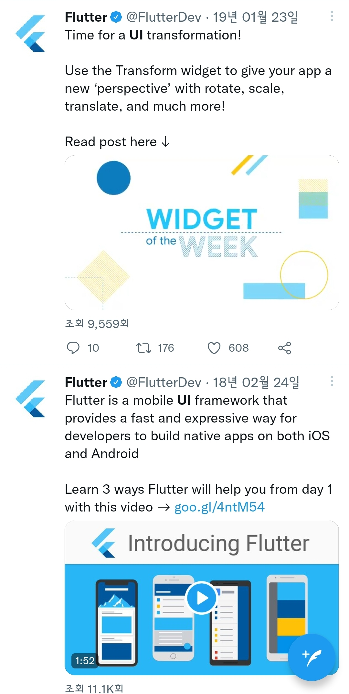
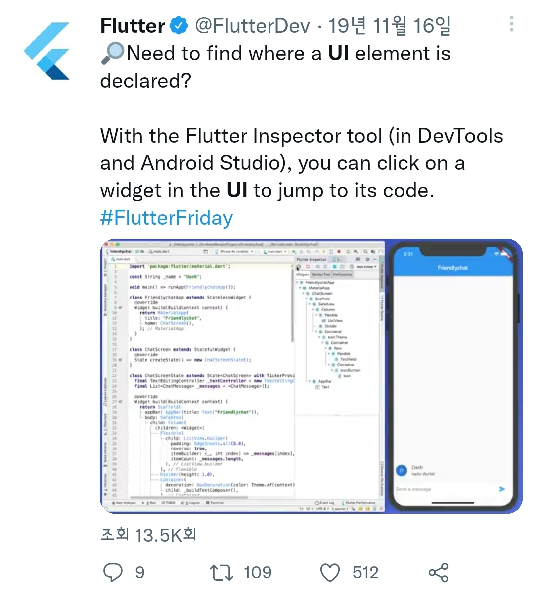
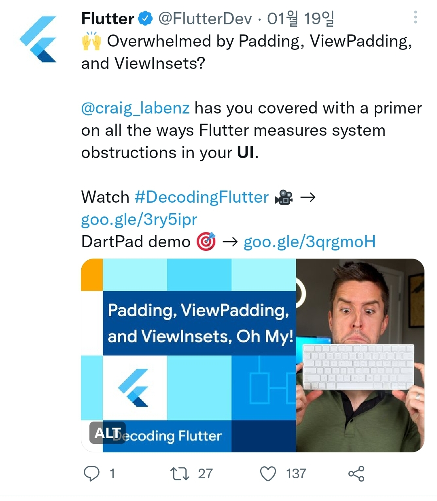

# NUI Components

- 현재 NUI Components 가이드 : 

    https://docs.tizen.org/application/dotnet/guides/user-interface/nui/ui-components/

    이미 트위터에 한번 올라온 적이 있음

- 타 플랫폼에서의 UI 관련 트위터 활동 :

    1. 홈페이지에서처럼 video 적극 활용 -> 하나의 item에 대해서도 'Widget of the week` 등의 주제로 간단한 샘플과 코드를 **약 1분대의 영상**으로 볼 수 있음

    |||
    |---|---|
    |||
    |||

        연결 영상 1) https://www.youtube.com/watch?v=fq4N0hgOWzU (유튜브)

        연결 영상 2) https://docs.flutter.dev/get-started/codelab (flutter dev)

    2-1. 각 element / property 등을 주제로 잡아 영상을 포스팅함 (포스팅하는 시간 간격 중요)

    2-2. Release 때마다 어떤 것이 바뀌었는지 세부적인 동작들도 영상 혹은 이미지로 제공
         (NUI의 경우, 성능 등도 이미지화 시켜서 보일 수 있으면 좋을 것 같음)

    |||
    |---|---|
    |||
    |||

- 참고로 Flutter는 Flutter Korea 계정이 따로 존재

 

## 방안을 모색해보자

 

**방안 1)** 기존에 있는 자료는, tizen docs의 [guide 페이지](https://docs.tizen.org/application/dotnet/guides/user-interface/nui/overview/)와 [API reference](https://docs.tizen.org/application/dotnet/api/TizenFX/API10/api/Tizen.NUI.Components.html)가 공식적입니다.

-> 이 페이지들은 필수적으로 넣긴 해야하고, 그 외 추가 기능들 업데이트가 필요해 보입니다.

 

**방안 2)** Tizen school 자료를 적극 활용하면 좋을 것 같습니다. 특히 영상을 위해선 작년에 촬영한 Hackathon 자료를 사용해도 좋을 것 같으나(유튜브도 있으니), 최소 영어 자막이 필요합니다.

-> 기본 NUI 소개 자료 : https://tizenschool.org/tutorial/242/contents/7

-> NUI Components 소개 자료 : https://tizenschool.org/tutorial/238/contents/4

-> NUI Components 설명 영상 :  https://www.youtube.com/watch?v=6eawDKQKM4Y

 

**방안 3)** 각 component마다 1분짜리의 영상을 만들면 너~무 좋을 것 같습니다.

 

**방안 4)** 샘플 페이지 정리화와 README 등 자세한 작성 필요

 

_현재 존재하는 nui 샘플들_

 - public sample - 1 : https://github.com/Samsung/Tizen-CSharp-Samples/tree/master/Mobile/NUI (mobile)

 - public sample - 2 : https://github.com/Samsung/Tizen-CSharp-Samples/tree/master/TV/NUI (TV)

 - github sample - 1 : https://github.com/Samsung/TizenFX/tree/master/test/Tizen.NUI.Samples

 - github sample - 2 : https://github.com/Samsung/TizenFX/tree/master/test/Tizen.NUI.StyleGuide

 - NUI Gallery app : https://github.com/nui-dali/NUITizenGallery

-------------------------------------------------------------------------

   (타 플랫폼 A 비교 1) : https://gallery.flutter.dev/#/

   (타 플랫폼 A 비교 2) : https://flutter.github.io/samples/# (github)

   (타 플랫폼 B 비교 1) : https://devblogs.microsoft.com/dotnet/dotnet-maui-rc-2/

   (타 플랫폼 B 비교 2) : https://github.com/Samsung/Tizen.NET/wiki/Build-your-first-.NET-MAUI-App-for-Tizen (github)

-------------------------------------------------------------------------

