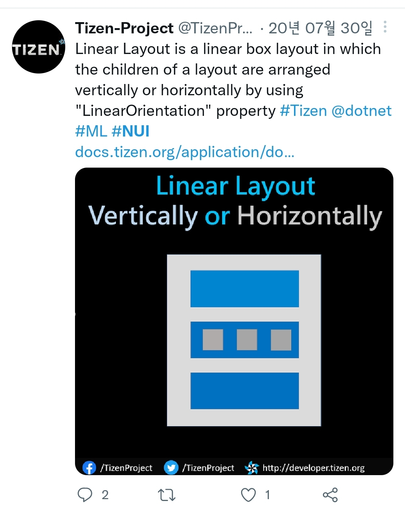
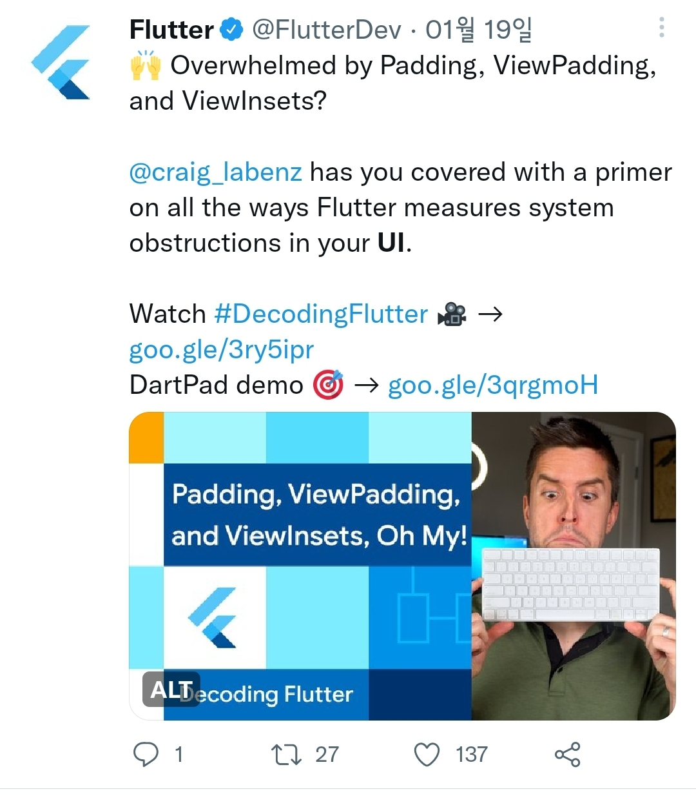

# NUI Layout

- 현재 Twitter에 올라와있는 NUI Layout은 앞서 [작성한 것](0.CurrentStatus.md/#3-layout-소개-및-가이드-페이지-연결)처럼 `LinearLayout`과 `GridLayout`, 그리고 `Custom Layout`이 간략하게 안내만 되어있고, 추가로 `FlexContainer`가 소개되어 있음

- 추가 API로 `LinearLayout`의 `Orientation`이 그림과 함께 나와있는데 이 부분은 좋은 것 같음

- 다만, 타 플랫폼 Layout 컨텐츠들에 비해 샘플 등의 사용법이 아직 부족

## 방안을 모색해보자

 

**방안 1)** 
최근에 추가된, `FlexLayout` 의 playground와 같은 샘플을 적극 활용

: https://github.com/Samsung/TizenFX/tree/master/test/Tizen.NUI.LayoutSamples

README와 같은 설치 방법, 혹은 실행 시 화면 스크린샷 (혹은 gif) 추가 필요

https://raw.githubusercontent.com/Samsung/TizenFX/fddf9e53b97eedaa8901cb1297a5a2f03f079eff/test/Tizen.NUI.LayoutSamples/Tizen.NUI.LayoutSamples/DisplayWindow.png
https://raw.githubusercontent.com/Samsung/TizenFX/fddf9e53b97eedaa8901cb1297a5a2f03f079eff/test/Tizen.NUI.LayoutSamples/Tizen.NUI.LayoutSamples/ControlWindowLayoutTab.png
https://raw.githubusercontent.com/Samsung/TizenFX/fddf9e53b97eedaa8901cb1297a5a2f03f079eff/test/Tizen.NUI.LayoutSamples/Tizen.NUI.LayoutSamples/ControlWindowViewTab.png

- Yoga layout의 playground : https://yogalayout.com/playground/

 

**방안 2)**
`LinearOrientation`에 대한 글도 올라왔으니, 각 property마다의 기능 소개도 좋을 것 같음.

padding / margin은 Layout의 필수기능이고, 타 플랫폼에서도 한차례 소개가 된 적이 있음

