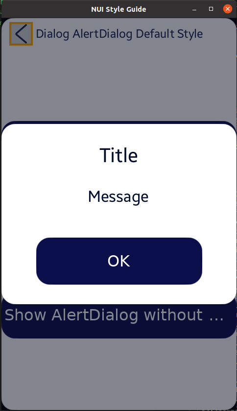

# Dialog And AlertDialog Example

NUI Components의 **키 동작 확인**을 위해 TizenFX에 있는 Tizen.NUI.StyleGuide의 샘플을 확인했습니다.

실행 환경 : Ubuntu 20.04 Terminal

```
seoyeon@seoyeon-linux:~/mywork/develmaster/TizenFX/test/Tizen.NUI.StyleGuide (DevelNUI)$ dotnet run
```

<br>
<br>

[DialogAndAlertDialogExample.cs](https://github.com/Samsung/TizenFX/blob/master/test/Tizen.NUI.StyleGuide/Examples/DialogAndAlertDialogExample.cs) 샘플을 실행시켜 AlertDialog (팝업 창)가 나오도록 button을 선택했을 때,

아래 그림과 같이 포커스를 나타내는 highlight box가 팝업이 뜬 후에도 뒤에 유지되고 있습니다.





