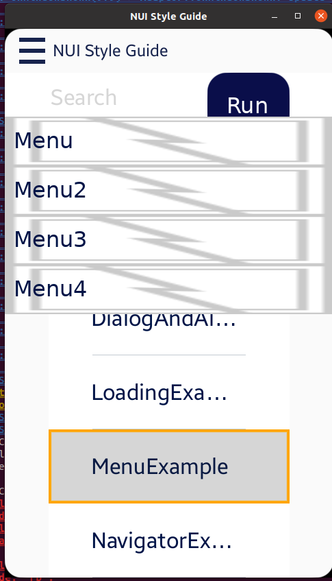

# Menu Example

NUI Components의 **키 동작 확인**을 위해 TizenFX에 있는 Tizen.NUI.StyleGuide의 샘플을 확인했습니다.

실행 환경 : Ubuntu 20.04 Terminal

```
seoyeon@seoyeon-linux:~/mywork/develmaster/TizenFX/test/Tizen.NUI.StyleGuide (DevelNUI)$ dotnet run
```

<br>
<br>

[MenuExample.cs](https://github.com/Samsung/TizenFX/blob/master/test/Tizen.NUI.StyleGuide/Examples/MenuExample.cs) 샘플을 실행시켜 오른쪽 상단에 있는 'More' 버튼을 선택해 `MenuItem` 들을 보이게 한 후에 

왼쪽 상단에 있는 뒤로 가기 버튼을 눌러 main 메뉴로 오면, 아래 그림과 같이 MenuItem들이 사라지지 않습니다.





**해결 방안 :**

`MenuItem`들이 앱의 Dispose() 시에 각 item들의 Dispose()를 부르고, null로 초기화시키도록 수정

(다른 NUI sample app들도 동일하게  하고 있음)

