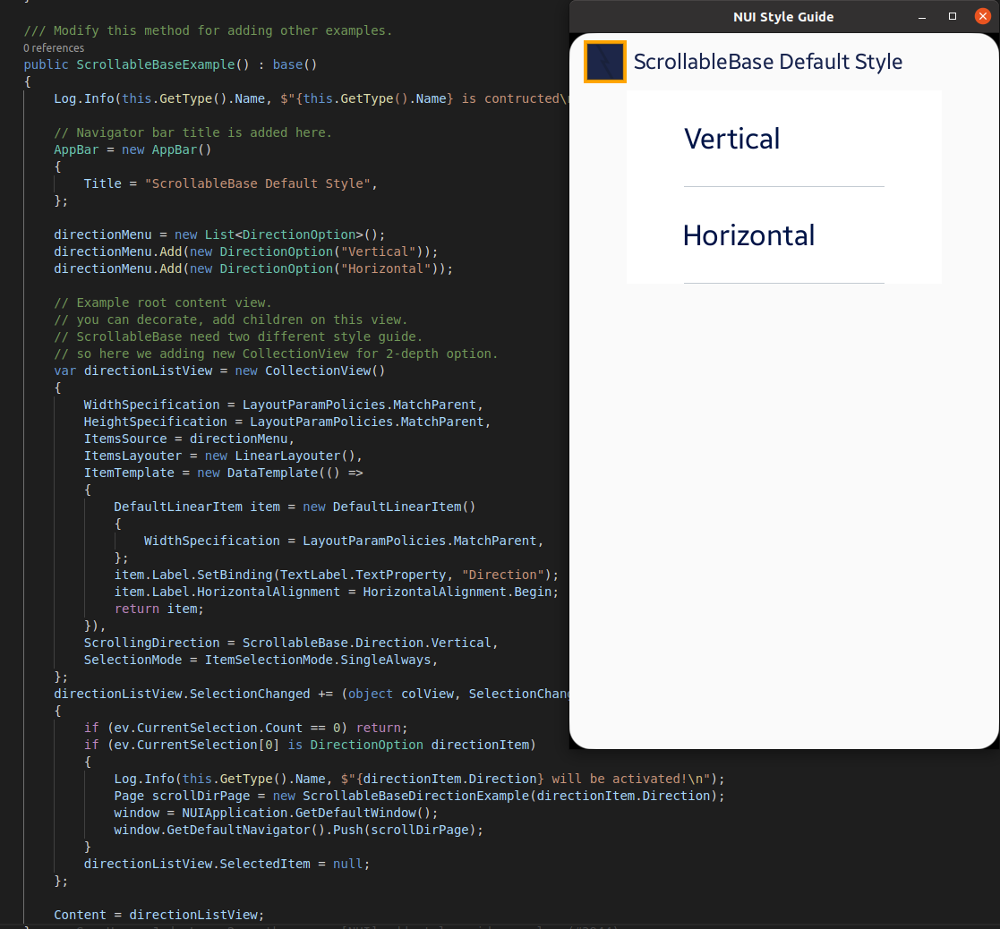

# ScrollableBase Example

NUI Components의 **키 동작 확인**을 위해 TizenFX에 있는 Tizen.NUI.StyleGuide의 샘플을 확인했습니다.

실행 환경 : Ubuntu 20.04 Terminal

```
seoyeon@seoyeon-linux:~/mywork/develmaster/TizenFX/test/Tizen.NUI.StyleGuide (DevelNUI)$ dotnet run
```

<br>
<br>

[ScrollableBaseExample.cs](https://github.com/Samsung/TizenFX/blob/master/test/Tizen.NUI.StyleGuide/Examples/ScrollableBase/ScrollableBaseExample.cs) 샘플을 실행시켰을 때, 키 포커스가 가지 않습니다.





Horizontal / Vertical 두 개의 리스트처럼 보이는 선택 부분에 포커스가 가야만 할 것 같습니다.

(이후, 한단계 depth를 더 들어간 후에는 Scroll 동작을 활용한 테스트)
