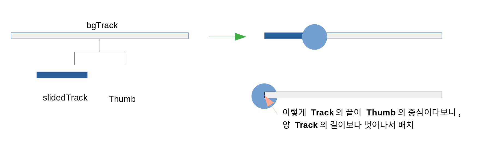
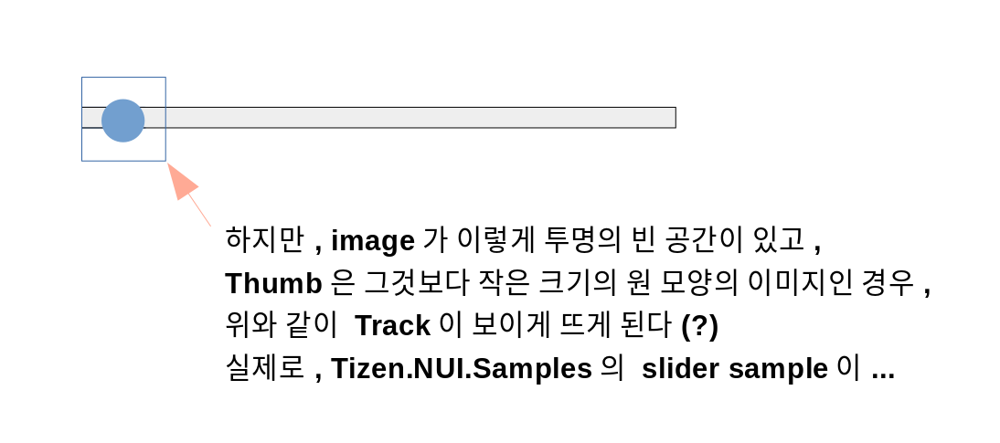
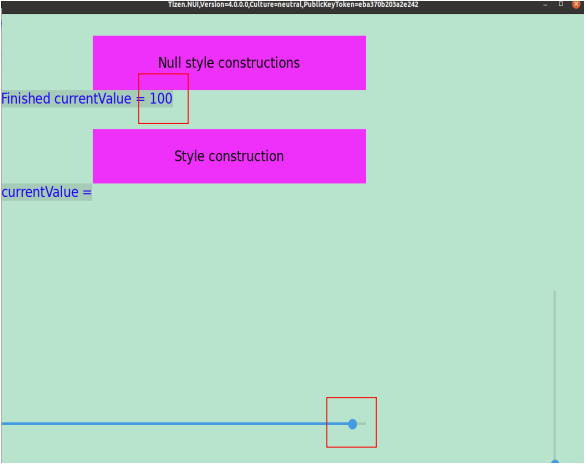

# Slider Issues

### Slider Thumb의 배치 문제

 

수정한 PR : https://github.com/Samsung/TizenFX/pull/4235/files

 

-> 결론 : 어쩔 수 없음.

현재 EFL 역시 upstream에서는 Image를 활용하기에 동일한 현상 발생.

mobile target에서는 이미지가 아닌, Vector로 그리기 때문에 발생하지 않을뿐.

