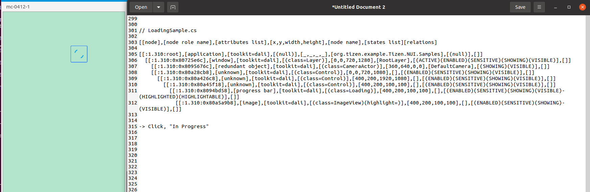

# Loading

TizenFX에 있는 Tizen.NUI.StyleGuide 샘플을 사용하여 확인했습니다.

`Loading` class를 확인하기 위해 

[LoadingExample.cs](https://github.com/Samsung/TizenFX/blob/master/test/Tizen.NUI.StyleGuide/Examples/LoadingExample.cs) 샘플을 통해 at-spi2-tool을 동작시켜 보았습니다.



왼쪽은 mobile emulator에서 샘플을 런칭한 화면이고, 오른쪽은 at-spi2-tool로 확인한 tree node입니다.

<br>

```
[[node],[node role name],[attributes list],[x,y,width,height],[node name],[states list][relations]

[[:1.310:root],[application],[toolkit=dali],[(null)],[_,_,_,_],[org.tizen.example.Tizen.NUI.Samples],[(null)],[]]
  [[:1.310:0x80725e6c],[window],[toolkit=dali],[(class=Layer)],[0,0,720,1280],[RootLayer],[(ACTIVE)(ENABLED)(SENSITIVE)(SHOWING)(VISIBLE)],[]]
    [[:1.310:0x8095676c],[redundant object],[toolkit=dali],[(class=CameraActor)],[360,640,0,0],[DefaultCamera],[(SHOWING)(VISIBLE)],[]]
    [[:1.310:0x80a28cb8],[unknown],[toolkit=dali],[(class=Control)],[0,0,720,1080],[],[(ENABLED)(SENSITIVE)(SHOWING)(VISIBLE)],[]]
      [[:1.310:0x80a426c8],[unknown],[toolkit=dali],[(class=Control)],[400,200,1920,1080],[],[(ENABLED)(SENSITIVE)(SHOWING)(VISIBLE)],[]]
        [[:1.310:0x80a45f18],[unknown],[toolkit=dali],[(class=Control)],[400,200,100,100],[],[(ENABLED)(SENSITIVE)(SHOWING)(VISIBLE)],[]]
          [[:1.310:0x8094bd58],[progress bar],[toolkit=dali],[(class=Loading)],[400,200,100,100],[],[(ENABLED)(SENSITIVE)(SHOWING)(VISIBLE)(HIGHLIGHTED)(HIGHLIGHTABLE)],[]]
            [[:1.310:0x80a5a9b8],[image],[toolkit=dali],[(class=ImageView)(highlight=)],[400,200,100,100],[],[(ENABLED)(SENSITIVE)(SHOWING)(VISIBLE)],[]]

// -> Touch, and say "In Progress"

```

<br>

### `AccessibilityName`이 필요한 곳?
 : 비쥬얼 요소로 텍스트가 있는 Component

- N/A

<br>

### `AccessibilityHidden` 적용을 위해 고려할 사항

- N/A 

