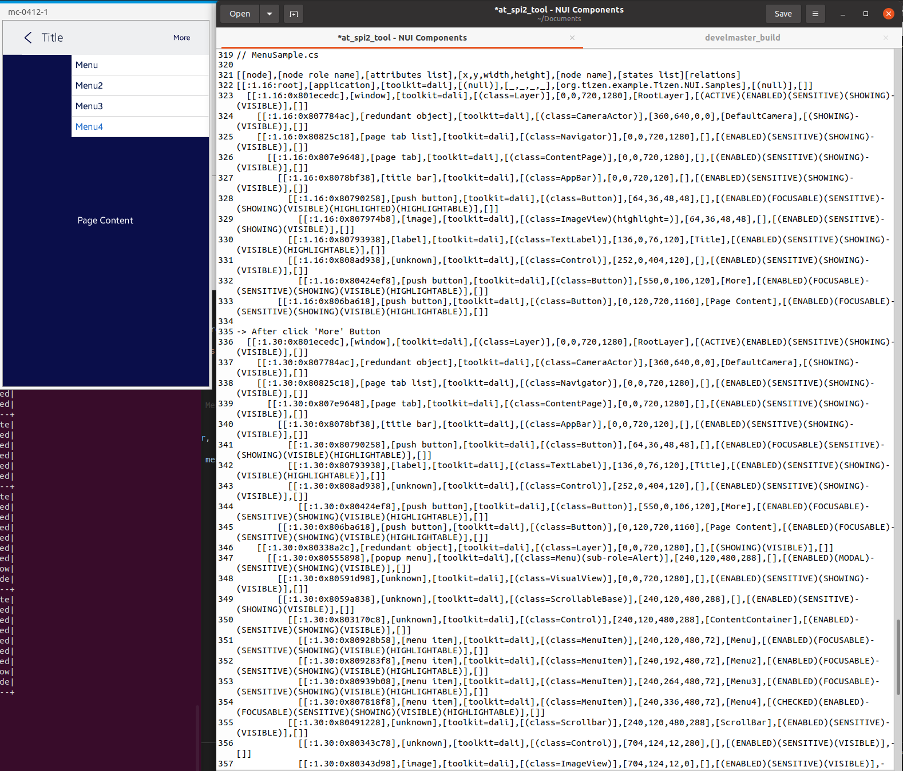

# Menu

TizenFX에 있는 Tizen.NUI.Samples의 샘플을 사용하여 확인했습니다.

`Menu` 와 `MenuItem` class들을 확인하기 위해 

[MenuSample.cs](https://github.com/Samsung/TizenFX/blob/master/test/Tizen.NUI.Samples/Tizen.NUI.Samples/Samples/MenuSample.cs) 샘플을 통해 at-spi2-tool을 동작시켜 보았습니다.



왼쪽은 mobile emulator에서 샘플을 런칭한 화면이고, 오른쪽은 at-spi2-tool로 확인한 tree node입니다.

<br>

```
[[node],[node role name],[attributes list],[x,y,width,height],[node name],[states list][relations]

[[:1.16:root],[application],[toolkit=dali],[(null)],[_,_,_,_],[org.tizen.example.Tizen.NUI.Samples],[(null)],[]]
  [[:1.16:0x801ecedc],[window],[toolkit=dali],[(class=Layer)],[0,0,720,1280],[RootLayer],[(ACTIVE)(ENABLED)(SENSITIVE)(SHOWING)(VISIBLE)],[]]
    [[:1.16:0x807784ac],[redundant object],[toolkit=dali],[(class=CameraActor)],[360,640,0,0],[DefaultCamera],[(SHOWING)(VISIBLE)],[]]
    [[:1.16:0x80825c18],[page tab list],[toolkit=dali],[(class=Navigator)],[0,0,720,1280],[],[(ENABLED)(SENSITIVE)(SHOWING)(VISIBLE)],[]]
      [[:1.16:0x807e9648],[page tab],[toolkit=dali],[(class=ContentPage)],[0,0,720,1280],[],[(ENABLED)(SENSITIVE)(SHOWING)(VISIBLE)],[]]
        [[:1.16:0x8078bf38],[title bar],[toolkit=dali],[(class=AppBar)],[0,0,720,120],[],[(ENABLED)(SENSITIVE)(SHOWING)(VISIBLE)],[]]
          [[:1.16:0x80790258],[push button],[toolkit=dali],[(class=Button)],[64,36,48,48],[],[(ENABLED)(FOCUSABLE)(SENSITIVE)(SHOWING)(VISIBLE)(HIGHLIGHTED)(HIGHLIGHTABLE)],[]]
            [[:1.16:0x807974b8],[image],[toolkit=dali],[(class=ImageView)(highlight=)],[64,36,48,48],[],[(ENABLED)(SENSITIVE)(SHOWING)(VISIBLE)],[]]
          [[:1.16:0x80793938],[label],[toolkit=dali],[(class=TextLabel)],[136,0,76,120],[Title],[(ENABLED)(SENSITIVE)(SHOWING)(VISIBLE)(HIGHLIGHTABLE)],[]]
          [[:1.16:0x808ad938],[unknown],[toolkit=dali],[(class=Control)],[252,0,404,120],[],[(ENABLED)(SENSITIVE)(SHOWING)(VISIBLE)],[]]
            [[:1.16:0x80424ef8],[push button],[toolkit=dali],[(class=Button)],[550,0,106,120],[More],[(ENABLED)(FOCUSABLE)(SENSITIVE)(SHOWING)(VISIBLE)(HIGHLIGHTABLE)],[]]
        [[:1.16:0x806ba618],[push button],[toolkit=dali],[(class=Button)],[0,120,720,1160],[Page Content],[(ENABLED)(FOCUSABLE)(SENSITIVE)(SHOWING)(VISIBLE)(HIGHLIGHTABLE)],[]]

// -> After click 'More' Button
  [[:1.30:0x801ecedc],[window],[toolkit=dali],[(class=Layer)],[0,0,720,1280],[RootLayer],[(ACTIVE)(ENABLED)(SENSITIVE)(SHOWING)(VISIBLE)],[]]
    [[:1.30:0x807784ac],[redundant object],[toolkit=dali],[(class=CameraActor)],[360,640,0,0],[DefaultCamera],[(SHOWING)(VISIBLE)],[]]
    [[:1.30:0x80825c18],[page tab list],[toolkit=dali],[(class=Navigator)],[0,0,720,1280],[],[(ENABLED)(SENSITIVE)(SHOWING)(VISIBLE)],[]]
      [[:1.30:0x807e9648],[page tab],[toolkit=dali],[(class=ContentPage)],[0,0,720,1280],[],[(ENABLED)(SENSITIVE)(SHOWING)(VISIBLE)],[]]
        [[:1.30:0x8078bf38],[title bar],[toolkit=dali],[(class=AppBar)],[0,0,720,120],[],[(ENABLED)(SENSITIVE)(SHOWING)(VISIBLE)],[]]
          [[:1.30:0x80790258],[push button],[toolkit=dali],[(class=Button)],[64,36,48,48],[],[(ENABLED)(FOCUSABLE)(SENSITIVE)(SHOWING)(VISIBLE)(HIGHLIGHTABLE)],[]]
          [[:1.30:0x80793938],[label],[toolkit=dali],[(class=TextLabel)],[136,0,76,120],[Title],[(ENABLED)(SENSITIVE)(SHOWING)(VISIBLE)(HIGHLIGHTABLE)],[]]
          [[:1.30:0x808ad938],[unknown],[toolkit=dali],[(class=Control)],[252,0,404,120],[],[(ENABLED)(SENSITIVE)(SHOWING)(VISIBLE)],[]]
            [[:1.30:0x80424ef8],[push button],[toolkit=dali],[(class=Button)],[550,0,106,120],[More],[(ENABLED)(FOCUSABLE)(SENSITIVE)(SHOWING)(VISIBLE)(HIGHLIGHTABLE)],[]]
        [[:1.30:0x806ba618],[push button],[toolkit=dali],[(class=Button)],[0,120,720,1160],[Page Content],[(ENABLED)(FOCUSABLE)(SENSITIVE)(SHOWING)(VISIBLE)(HIGHLIGHTABLE)],[]]
    [[:1.30:0x80338a2c],[redundant object],[toolkit=dali],[(class=Layer)],[0,0,720,1280],[],[(SHOWING)(VISIBLE)],[]]
      [[:1.30:0x80555898],[popup menu],[toolkit=dali],[(class=Menu)(sub-role=Alert)],[240,120,480,288],[],[(ENABLED)(MODAL)(SENSITIVE)(SHOWING)(VISIBLE)],[]]
        [[:1.30:0x80591d98],[unknown],[toolkit=dali],[(class=VisualView)],[0,0,720,1280],[],[(ENABLED)(SENSITIVE)(SHOWING)(VISIBLE)],[]]
        [[:1.30:0x8059a838],[unknown],[toolkit=dali],[(class=ScrollableBase)],[240,120,480,288],[],[(ENABLED)(SENSITIVE)(SHOWING)(VISIBLE)],[]]
          [[:1.30:0x803170c8],[unknown],[toolkit=dali],[(class=Control)],[240,120,480,288],[ContentContainer],[(ENABLED)(SENSITIVE)(SHOWING)(VISIBLE)],[]]
            [[:1.30:0x80928b58],[menu item],[toolkit=dali],[(class=MenuItem)],[240,120,480,72],[Menu],[(ENABLED)(FOCUSABLE)(SENSITIVE)(SHOWING)(VISIBLE)(HIGHLIGHTABLE)],[]]
            [[:1.30:0x809283f8],[menu item],[toolkit=dali],[(class=MenuItem)],[240,192,480,72],[Menu2],[(ENABLED)(FOCUSABLE)(SENSITIVE)(SHOWING)(VISIBLE)(HIGHLIGHTABLE)],[]]
            [[:1.30:0x80939b08],[menu item],[toolkit=dali],[(class=MenuItem)],[240,264,480,72],[Menu3],[(ENABLED)(FOCUSABLE)(SENSITIVE)(SHOWING)(VISIBLE)(HIGHLIGHTABLE)],[]]
            [[:1.30:0x807818f8],[menu item],[toolkit=dali],[(class=MenuItem)],[240,336,480,72],[Menu4],[(CHECKED)(ENABLED)(FOCUSABLE)(SENSITIVE)(SHOWING)(VISIBLE)(HIGHLIGHTABLE)],[]]
          [[:1.30:0x80491228],[unknown],[toolkit=dali],[(class=Scrollbar)],[240,120,480,288],[ScrollBar],[(ENABLED)(SENSITIVE)(VISIBLE)],[]]
            [[:1.30:0x80343c78],[unknown],[toolkit=dali],[(class=Control)],[704,124,12,280],[],[(ENABLED)(SENSITIVE)(VISIBLE)],[]]
            [[:1.30:0x80343d98],[image],[toolkit=dali],[(class=ImageView)],[704,124,12,0],[],[(ENABLED)(SENSITIVE)(VISIBLE)],[]]

```

<br>

### `AccessibilityName`이 필요한 곳?
 : 비쥬얼 요소로 텍스트가 있는 Component

- N/A : MenuItem에 Text 설정시, Button의 Text property를 사용

<br>

### `AccessibilityHidden` 적용을 위해 고려할 사항

- 'Menu'와 'ScrollableBase' 사이의 VisualView의 역할

  -> 역시 Scrim임 [DialogPage](./2_DialogPage.md) 와 동일하게 유지.
  
- 마지막의 Scrollbar와 Control, ImageView의 트리에 보여야 하는지 여부

  -> Scrollbar의 Control은 Hidden으로!


