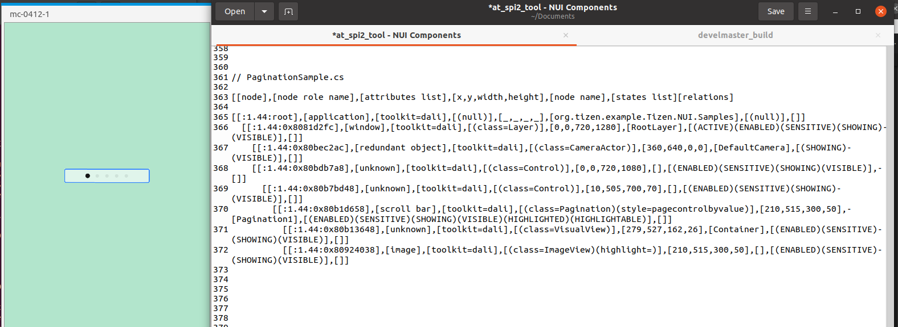

# Pagination

TizenFX에 있는 Tizen.NUI.Samples의 샘플을 사용하여 확인했습니다.

`Pagination` class를 확인하기 위해 

[PaginationSample.cs](https://github.com/Samsung/TizenFX/blob/master/test/Tizen.NUI.Samples/Tizen.NUI.Samples/Samples/PaginationSample.cs) 샘플을 통해 at-spi2-tool을 동작시켜 보았습니다.



왼쪽은 mobile emulator에서 샘플을 런칭한 화면이고, 오른쪽은 at-spi2-tool로 확인한 tree node입니다.

<br>

```
[[node],[node role name],[attributes list],[x,y,width,height],[node name],[states list][relations]

[[:1.44:root],[application],[toolkit=dali],[(null)],[_,_,_,_],[org.tizen.example.Tizen.NUI.Samples],[(null)],[]]
  [[:1.44:0x8081d2fc],[window],[toolkit=dali],[(class=Layer)],[0,0,720,1280],[RootLayer],[(ACTIVE)(ENABLED)(SENSITIVE)(SHOWING)(VISIBLE)],[]]
    [[:1.44:0x80bec2ac],[redundant object],[toolkit=dali],[(class=CameraActor)],[360,640,0,0],[DefaultCamera],[(SHOWING)(VISIBLE)],[]]
    [[:1.44:0x80bdb7a8],[unknown],[toolkit=dali],[(class=Control)],[0,0,720,1080],[],[(ENABLED)(SENSITIVE)(SHOWING)(VISIBLE)],[]]
      [[:1.44:0x80b7bd48],[unknown],[toolkit=dali],[(class=Control)],[10,505,700,70],[],[(ENABLED)(SENSITIVE)(SHOWING)(VISIBLE)],[]]
        [[:1.44:0x80b1d658],[scroll bar],[toolkit=dali],[(class=Pagination)(style=pagecontrolbyvalue)],[210,515,300,50],[Pagination1],[(ENABLED)(SENSITIVE)(SHOWING)(VISIBLE)(HIGHLIGHTED)(HIGHLIGHTABLE)],[]]
          [[:1.44:0x80b13648],[unknown],[toolkit=dali],[(class=VisualView)],[279,527,162,26],[Container],[(ENABLED)(SENSITIVE)(SHOWING)(VISIBLE)],[]]
          [[:1.44:0x80924038],[image],[toolkit=dali],[(class=ImageView)(highlight=)],[210,515,300,50],[],[(ENABLED)(SENSITIVE)(SHOWING)(VISIBLE)],[]]

```

<br>

### `AccessibilityName`이 필요한 곳?
 : 비쥬얼 요소로 텍스트가 있는 Component

- N/A

<br>

### `AccessibilityHidden` 적용을 위해 고려할 사항

- Container 역할을 하는 VisualView가 tree에 보여야할까?

