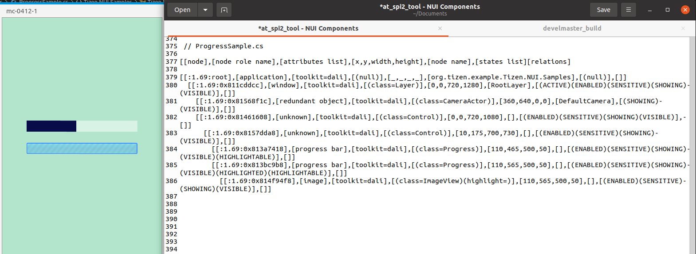

# Progress

TizenFX에 있는 Tizen.NUI.StyleGuide의 샘플을 사용하여 확인했습니다.

`Progress` class를 확인하기 위해 

[ProgressExample.cs](https://github.com/Samsung/TizenFX/blob/master/test/Tizen.NUI.StyleGuide/Examples/ProgressExample.cs) 샘플을 통해 at-spi2-tool을 동작시켜 보았습니다.



왼쪽은 mobile emulator에서 샘플을 런칭한 화면이고, 오른쪽은 at-spi2-tool로 확인한 tree node입니다.

<br>

```
[[node],[node role name],[attributes list],[x,y,width,height],[node name],[states list][relations]

[[:1.69:root],[application],[toolkit=dali],[(null)],[_,_,_,_],[org.tizen.example.Tizen.NUI.Samples],[(null)],[]]
  [[:1.69:0x811cddcc],[window],[toolkit=dali],[(class=Layer)],[0,0,720,1280],[RootLayer],[(ACTIVE)(ENABLED)(SENSITIVE)(SHOWING)(VISIBLE)],[]]
    [[:1.69:0x81568f1c],[redundant object],[toolkit=dali],[(class=CameraActor)],[360,640,0,0],[DefaultCamera],[(SHOWING)(VISIBLE)],[]]
    [[:1.69:0x81461608],[unknown],[toolkit=dali],[(class=Control)],[0,0,720,1080],[],[(ENABLED)(SENSITIVE)(SHOWING)(VISIBLE)],[]]
      [[:1.69:0x8157dda8],[unknown],[toolkit=dali],[(class=Control)],[10,175,700,730],[],[(ENABLED)(SENSITIVE)(SHOWING)(VISIBLE)],[]]
        [[:1.69:0x813a7418],[progress bar],[toolkit=dali],[(class=Progress)],[110,465,500,50],[],[(ENABLED)(SENSITIVE)(SHOWING)(VISIBLE)(HIGHLIGHTABLE)],[]]
        [[:1.69:0x813bc9b8],[progress bar],[toolkit=dali],[(class=Progress)],[110,565,500,50],[],[(ENABLED)(SENSITIVE)(SHOWING)(VISIBLE)(HIGHLIGHTED)(HIGHLIGHTABLE)],[]]
          [[:1.69:0x814f94f8],[image],[toolkit=dali],[(class=ImageView)(highlight=)],[110,565,500,50],[],[(ENABLED)(SENSITIVE)(SHOWING)(VISIBLE)],[]]

```

<br>

### `AccessibilityName`이 필요한 곳?
 : 비쥬얼 요소로 텍스트가 있는 Component

- N/A

<br>

### `AccessibilityHidden` 적용을 위해 고려할 사항

- N/A

