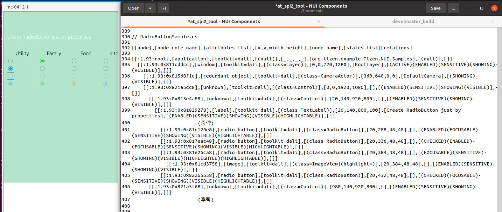

# RadioButton

TizenFX에 있는 Tizen.NUI.Samples의 샘플을 사용하여 확인했습니다.

`RadioButton` class를 확인하기 위해 

[RadioButtonSample.cs](https://github.com/Samsung/TizenFX/blob/master/test/Tizen.NUI.Samples/Tizen.NUI.Samples/Samples/RadioButtonSample.cs) 샘플을 통해 at-spi2-tool을 동작시켜 보았습니다.



왼쪽은 mobile emulator에서 샘플을 런칭한 화면이고, 오른쪽은 at-spi2-tool로 확인한 tree node입니다.

<br>

```
[[node],[node role name],[attributes list],[x,y,width,height],[node name],[states list][relations]

[[:1.93:root],[application],[toolkit=dali],[(null)],[_,_,_,_],[org.tizen.example.Tizen.NUI.Samples],[(null)],[]]
  [[:1.93:0x811cddcc],[window],[toolkit=dali],[(class=Layer)],[0,0,720,1280],[RootLayer],[(ACTIVE)(ENABLED)(SENSITIVE)(SHOWING)(VISIBLE)],[]]
    [[:1.93:0x81568f1c],[redundant object],[toolkit=dali],[(class=CameraActor)],[360,640,0,0],[DefaultCamera],[(SHOWING)(VISIBLE)],[]]
    [[:1.93:0x821a5cc8],[unknown],[toolkit=dali],[(class=Control)],[0,0,1920,1080],[],[(ENABLED)(SENSITIVE)(SHOWING)(VISIBLE)],[]]
      [[:1.93:0x813e4a88],[unknown],[toolkit=dali],[(class=Control)],[20,140,920,800],[],[(ENABLED)(SENSITIVE)(SHOWING)(VISIBLE)],[]]
        [[:1.93:0x81829278],[label],[toolkit=dali],[(class=TextLabel)],[20,140,800,100],[Create RadioButton just by properties],[(ENABLED)(SENSITIVE)(SHOWING)(VISIBLE)(HIGHLIGHTABLE)],[]]
            		(중략)
          [[:1.93:0x81c126e8],[radio button],[toolkit=dali],[(class=RadioButton)],[20,288,48,48],[],[(ENABLED)(FOCUSABLE)(SENSITIVE)(SHOWING)(VISIBLE)(HIGHLIGHTABLE)],[]]
          [[:1.93:0x817eac48],[radio button],[toolkit=dali],[(class=RadioButton)],[20,336,48,48],[],[(CHECKED)(ENABLED)(FOCUSABLE)(SENSITIVE)(SHOWING)(VISIBLE)(HIGHLIGHTABLE)],[]]
          [[:1.93:0x81e26ca8],[radio button],[toolkit=dali],[(class=RadioButton)],[20,384,48,48],[],[(FOCUSABLE)(SENSITIVE)(SHOWING)(VISIBLE)(HIGHLIGHTED)(HIGHLIGHTABLE)],[]]
            [[:1.93:0x81cd3758],[image],[toolkit=dali],[(class=ImageView)(highlight=)],[20,384,48,48],[],[(ENABLED)(SENSITIVE)(SHOWING)(VISIBLE)],[]]
          [[:1.93:0x82265558],[radio button],[toolkit=dali],[(class=RadioButton)],[20,432,48,48],[],[(CHECKED)(FOCUSABLE)(SENSITIVE)(SHOWING)(VISIBLE)(HIGHLIGHTABLE)],[]]
      [[:1.93:0x821a5f68],[unknown],[toolkit=dali],[(class=Control)],[980,140,920,800],[],[(ENABLED)(SENSITIVE)(SHOWING)(VISIBLE)],[]]
            		(후략)

```

<br>

### `AccessibilityName`이 필요한 곳?
 : 비쥬얼 요소로 텍스트가 있는 Component

- N/A

<br>

### `AccessibilityHidden` 적용을 위해 고려할 사항

- N/A

