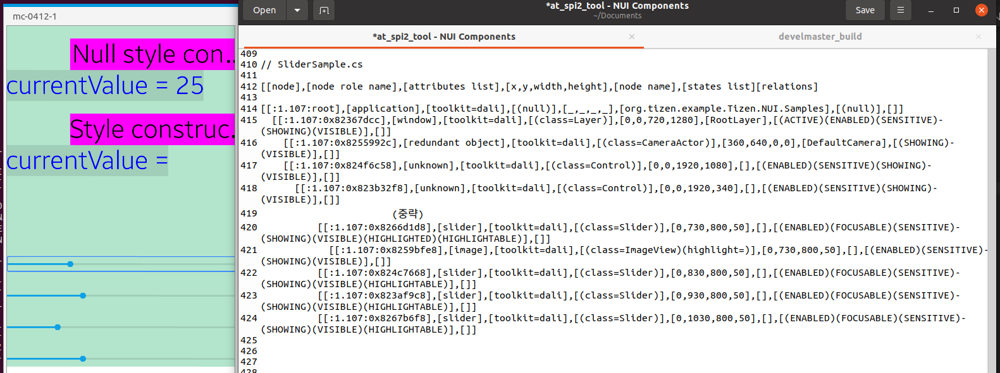

# Slider

TizenFX에 있는 Tizen.NUI.Samples의 샘플을 사용하여 확인했습니다.

`Slider` class를 확인하기 위해 

[SliderSample.cs](https://github.com/Samsung/TizenFX/blob/master/test/Tizen.NUI.Samples/Tizen.NUI.Samples/Samples/SliderSample.cs) 샘플을 통해 at-spi2-tool을 동작시켜 보았습니다.



왼쪽은 mobile emulator에서 샘플을 런칭한 화면이고, 오른쪽은 at-spi2-tool로 확인한 tree node입니다.

<br>

```
[[node],[node role name],[attributes list],[x,y,width,height],[node name],[states list][relations]

[[:1.107:root],[application],[toolkit=dali],[(null)],[_,_,_,_],[org.tizen.example.Tizen.NUI.Samples],[(null)],[]]
  [[:1.107:0x82367dcc],[window],[toolkit=dali],[(class=Layer)],[0,0,720,1280],[RootLayer],[(ACTIVE)(ENABLED)(SENSITIVE)(SHOWING)(VISIBLE)],[]]
    [[:1.107:0x8255992c],[redundant object],[toolkit=dali],[(class=CameraActor)],[360,640,0,0],[DefaultCamera],[(SHOWING)(VISIBLE)],[]]
    [[:1.107:0x824f6c58],[unknown],[toolkit=dali],[(class=Control)],[0,0,1920,1080],[],[(ENABLED)(SENSITIVE)(SHOWING)(VISIBLE)],[]]
      [[:1.107:0x823b32f8],[unknown],[toolkit=dali],[(class=Control)],[0,0,1920,340],[],[(ENABLED)(SENSITIVE)(SHOWING)(VISIBLE)],[]]
            		(중략)
          [[:1.107:0x8266d1d8],[slider],[toolkit=dali],[(class=Slider)],[0,730,800,50],[],[(ENABLED)(FOCUSABLE)(SENSITIVE)(SHOWING)(VISIBLE)(HIGHLIGHTED)(HIGHLIGHTABLE)],[]]
            [[:1.107:0x8259bfe8],[image],[toolkit=dali],[(class=ImageView)(highlight=)],[0,730,800,50],[],[(ENABLED)(SENSITIVE)(SHOWING)(VISIBLE)],[]]
          [[:1.107:0x824c7668],[slider],[toolkit=dali],[(class=Slider)],[0,830,800,50],[],[(ENABLED)(FOCUSABLE)(SENSITIVE)(SHOWING)(VISIBLE)(HIGHLIGHTABLE)],[]]
          [[:1.107:0x823af9c8],[slider],[toolkit=dali],[(class=Slider)],[0,930,800,50],[],[(ENABLED)(FOCUSABLE)(SENSITIVE)(SHOWING)(VISIBLE)(HIGHLIGHTABLE)],[]]
          [[:1.107:0x8267b6f8],[slider],[toolkit=dali],[(class=Slider)],[0,1030,800,50],[],[(ENABLED)(FOCUSABLE)(SENSITIVE)(SHOWING)(VISIBLE)(HIGHLIGHTABLE)],[]]

```

<br>

### `AccessibilityName`이 필요한 곳?
 : 비쥬얼 요소로 텍스트가 있는 Component

- 현재 사용되지 않는 Low / High / Value Indicators 에 Name이나 Description 등을 설정해줘야 할 지 고민.

<br>

### `AccessibilityHidden` 적용을 위해 고려할 사항

- N/A

