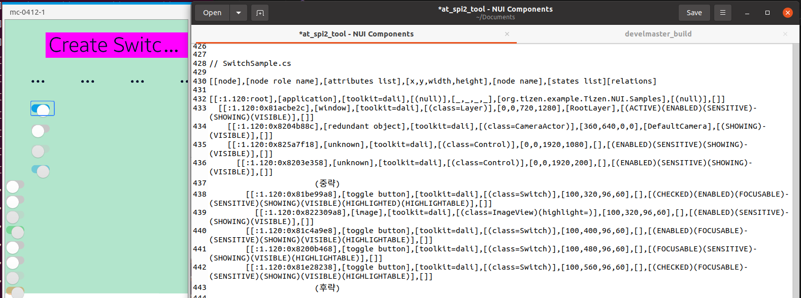

# Switch

TizenFX에 있는 Tizen.NUI.Samples의 샘플을 사용하여 확인했습니다.

`Switch` class를 확인하기 위해 

[SwitchSample.cs](https://github.com/Samsung/TizenFX/blob/master/test/Tizen.NUI.Samples/Tizen.NUI.Samples/Samples/SwitchSample.cs) 샘플을 통해 at-spi2-tool을 동작시켜 보았습니다.



왼쪽은 mobile emulator에서 샘플을 런칭한 화면이고, 오른쪽은 at-spi2-tool로 확인한 tree node입니다.

<br>

```
[[node],[node role name],[attributes list],[x,y,width,height],[node name],[states list][relations]

[[:1.120:root],[application],[toolkit=dali],[(null)],[_,_,_,_],[org.tizen.example.Tizen.NUI.Samples],[(null)],[]]
  [[:1.120:0x81acbe2c],[window],[toolkit=dali],[(class=Layer)],[0,0,720,1280],[RootLayer],[(ACTIVE)(ENABLED)(SENSITIVE)(SHOWING)(VISIBLE)],[]]
    [[:1.120:0x8204b88c],[redundant object],[toolkit=dali],[(class=CameraActor)],[360,640,0,0],[DefaultCamera],[(SHOWING)(VISIBLE)],[]]
    [[:1.120:0x825a7f18],[unknown],[toolkit=dali],[(class=Control)],[0,0,1920,1080],[],[(ENABLED)(SENSITIVE)(SHOWING)(VISIBLE)],[]]
      [[:1.120:0x8203e358],[unknown],[toolkit=dali],[(class=Control)],[0,0,1920,200],[],[(ENABLED)(SENSITIVE)(SHOWING)(VISIBLE)],[]]
            		(중략)
        [[:1.120:0x81be99a8],[toggle button],[toolkit=dali],[(class=Switch)],[100,320,96,60],[],[(CHECKED)(ENABLED)(FOCUSABLE)(SENSITIVE)(SHOWING)(VISIBLE)(HIGHLIGHTED)(HIGHLIGHTABLE)],[]]
          [[:1.120:0x822309a8],[image],[toolkit=dali],[(class=ImageView)(highlight=)],[100,320,96,60],[],[(ENABLED)(SENSITIVE)(SHOWING)(VISIBLE)],[]]
        [[:1.120:0x81c4a9e8],[toggle button],[toolkit=dali],[(class=Switch)],[100,400,96,60],[],[(ENABLED)(FOCUSABLE)(SENSITIVE)(SHOWING)(VISIBLE)(HIGHLIGHTABLE)],[]]
        [[:1.120:0x8200b468],[toggle button],[toolkit=dali],[(class=Switch)],[100,480,96,60],[],[(FOCUSABLE)(SENSITIVE)(SHOWING)(VISIBLE)(HIGHLIGHTABLE)],[]]
        [[:1.120:0x81e28238],[toggle button],[toolkit=dali],[(class=Switch)],[100,560,96,60],[],[(CHECKED)(FOCUSABLE)(SENSITIVE)(SHOWING)(VISIBLE)(HIGHLIGHTABLE)],[]]
            		(후략)

```

<br>

### `AccessibilityName`이 필요한 곳?
 : 비쥬얼 요소로 텍스트가 있는 Component

- N/A

<br>

### `AccessibilityHidden` 적용을 위해 고려할 사항

- N/A

