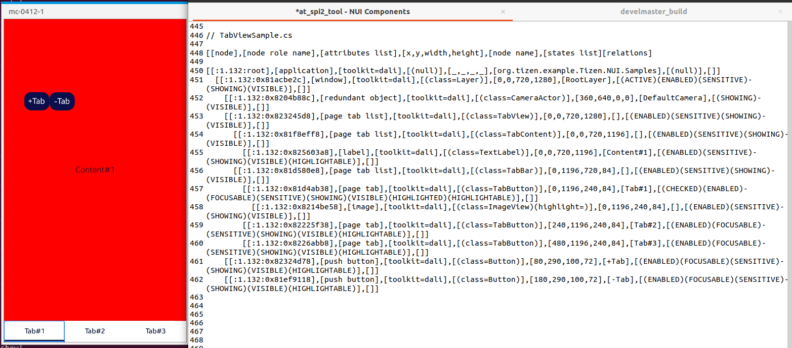

# TabView

TizenFX에 있는 Tizen.NUI.Samples의 샘플을 사용하여 확인했습니다.

`TabView`, `TabBar`, `TabButton`, `TabContent` class들을 확인하기 위해 

[TabViewSample.cs](https://github.com/Samsung/TizenFX/blob/master/test/Tizen.NUI.Samples/Tizen.NUI.Samples/Samples/TabViewSample.cs) 샘플을 통해 at-spi2-tool을 동작시켜 보았습니다.



왼쪽은 mobile emulator에서 샘플을 런칭한 화면이고, 오른쪽은 at-spi2-tool로 확인한 tree node입니다.

<br>

```
[[node],[node role name],[attributes list],[x,y,width,height],[node name],[states list][relations]

[[:1.132:root],[application],[toolkit=dali],[(null)],[_,_,_,_],[org.tizen.example.Tizen.NUI.Samples],[(null)],[]]
  [[:1.132:0x81acbe2c],[window],[toolkit=dali],[(class=Layer)],[0,0,720,1280],[RootLayer],[(ACTIVE)(ENABLED)(SENSITIVE)(SHOWING)(VISIBLE)],[]]
    [[:1.132:0x8204b88c],[redundant object],[toolkit=dali],[(class=CameraActor)],[360,640,0,0],[DefaultCamera],[(SHOWING)(VISIBLE)],[]]
    [[:1.132:0x823245d8],[page tab list],[toolkit=dali],[(class=TabView)],[0,0,720,1280],[],[(ENABLED)(SENSITIVE)(SHOWING)(VISIBLE)],[]]
      [[:1.132:0x81f8eff8],[page tab list],[toolkit=dali],[(class=TabContent)],[0,0,720,1196],[],[(ENABLED)(SENSITIVE)(SHOWING)(VISIBLE)],[]]
        [[:1.132:0x825603a8],[label],[toolkit=dali],[(class=TextLabel)],[0,0,720,1196],[Content#1],[(ENABLED)(SENSITIVE)(SHOWING)(VISIBLE)(HIGHLIGHTABLE)],[]]
      [[:1.132:0x81d580e8],[page tab list],[toolkit=dali],[(class=TabBar)],[0,1196,720,84],[],[(ENABLED)(SENSITIVE)(SHOWING)(VISIBLE)],[]]
        [[:1.132:0x81d4ab38],[page tab],[toolkit=dali],[(class=TabButton)],[0,1196,240,84],[Tab#1],[(CHECKED)(ENABLED)(FOCUSABLE)(SENSITIVE)(SHOWING)(VISIBLE)(HIGHLIGHTED)(HIGHLIGHTABLE)],[]]
          [[:1.132:0x8214be58],[image],[toolkit=dali],[(class=ImageView)(highlight=)],[0,1196,240,84],[],[(ENABLED)(SENSITIVE)(SHOWING)(VISIBLE)],[]]
        [[:1.132:0x82225f38],[page tab],[toolkit=dali],[(class=TabButton)],[240,1196,240,84],[Tab#2],[(ENABLED)(FOCUSABLE)(SENSITIVE)(SHOWING)(VISIBLE)(HIGHLIGHTABLE)],[]]
        [[:1.132:0x8226abb8],[page tab],[toolkit=dali],[(class=TabButton)],[480,1196,240,84],[Tab#3],[(ENABLED)(FOCUSABLE)(SENSITIVE)(SHOWING)(VISIBLE)(HIGHLIGHTABLE)],[]]
    [[:1.132:0x82324d78],[push button],[toolkit=dali],[(class=Button)],[80,290,100,72],[+Tab],[(ENABLED)(FOCUSABLE)(SENSITIVE)(SHOWING)(VISIBLE)(HIGHLIGHTABLE)],[]]
    [[:1.132:0x81ef9118],[push button],[toolkit=dali],[(class=Button)],[180,290,100,72],[-Tab],[(ENABLED)(FOCUSABLE)(SENSITIVE)(SHOWING)(VISIBLE)(HIGHLIGHTABLE)],[]]

```

<br>

### `AccessibilityName`이 필요한 곳?
 : 비쥬얼 요소로 텍스트가 있는 Component

- N/A : SelectButton을 상속받은 TabButton은 Button의 Text property로 설정 / Content 역시 TextLabel class 활용

<br>

### `AccessibilityHidden` 적용을 위해 고려할 사항

- N/A

