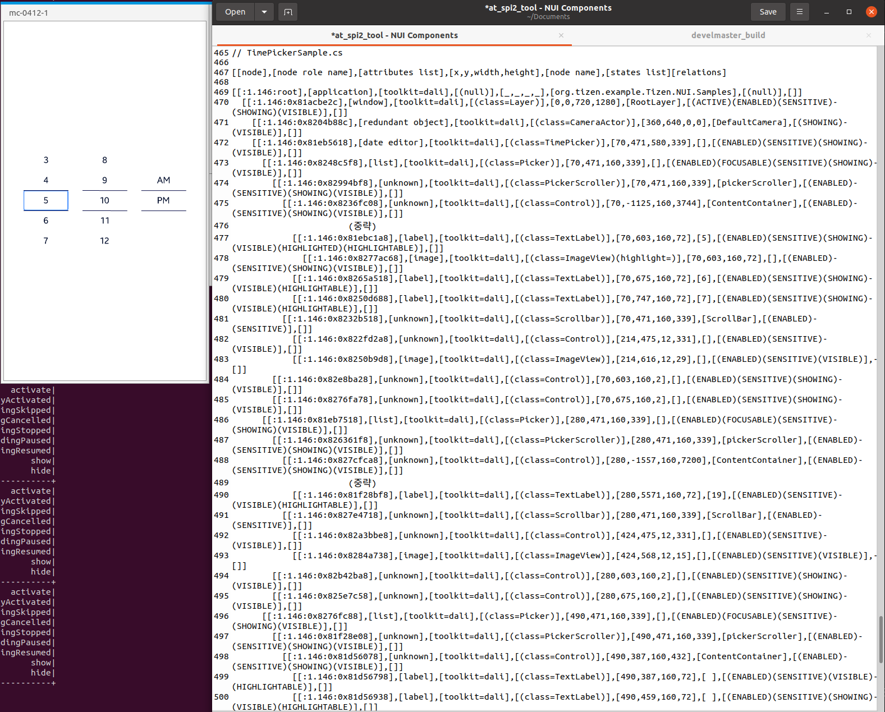

# TimePicker

TizenFX에 있는 Tizen.NUI.Samples의 샘플을 사용하여 확인했습니다.

`TimePicker` class를 확인하기 위해 

[TimePickerSample.cs](https://github.com/Samsung/TizenFX/blob/master/test/Tizen.NUI.Samples/Tizen.NUI.Samples/Samples/TimePickerSample.cs) 샘플을 통해 at-spi2-tool을 동작시켜 보았습니다.



왼쪽은 mobile emulator에서 샘플을 런칭한 화면이고, 오른쪽은 at-spi2-tool로 확인한 tree node입니다.

<br>

```
[[node],[node role name],[attributes list],[x,y,width,height],[node name],[states list][relations]

[[:1.146:root],[application],[toolkit=dali],[(null)],[_,_,_,_],[org.tizen.example.Tizen.NUI.Samples],[(null)],[]]
  [[:1.146:0x81acbe2c],[window],[toolkit=dali],[(class=Layer)],[0,0,720,1280],[RootLayer],[(ACTIVE)(ENABLED)(SENSITIVE)(SHOWING)(VISIBLE)],[]]
    [[:1.146:0x8204b88c],[redundant object],[toolkit=dali],[(class=CameraActor)],[360,640,0,0],[DefaultCamera],[(SHOWING)(VISIBLE)],[]]
    [[:1.146:0x81eb5618],[date editor],[toolkit=dali],[(class=TimePicker)],[70,471,580,339],[],[(ENABLED)(SENSITIVE)(SHOWING)(VISIBLE)],[]]
      [[:1.146:0x8248c5f8],[list],[toolkit=dali],[(class=Picker)],[70,471,160,339],[],[(ENABLED)(FOCUSABLE)(SENSITIVE)(SHOWING)(VISIBLE)],[]]
        [[:1.146:0x82994bf8],[unknown],[toolkit=dali],[(class=PickerScroller)],[70,471,160,339],[pickerScroller],[(ENABLED)(SENSITIVE)(SHOWING)(VISIBLE)],[]]
          [[:1.146:0x8236fc08],[unknown],[toolkit=dali],[(class=Control)],[70,-1125,160,3744],[ContentContainer],[(ENABLED)(SENSITIVE)(SHOWING)(VISIBLE)],[]]
            		(중략)
            [[:1.146:0x81ebc1a8],[label],[toolkit=dali],[(class=TextLabel)],[70,603,160,72],[5],[(ENABLED)(SENSITIVE)(SHOWING)(VISIBLE)(HIGHLIGHTED)(HIGHLIGHTABLE)],[]]
              [[:1.146:0x8277ac68],[image],[toolkit=dali],[(class=ImageView)(highlight=)],[70,603,160,72],[],[(ENABLED)(SENSITIVE)(SHOWING)(VISIBLE)],[]]
            [[:1.146:0x8265a518],[label],[toolkit=dali],[(class=TextLabel)],[70,675,160,72],[6],[(ENABLED)(SENSITIVE)(SHOWING)(VISIBLE)(HIGHLIGHTABLE)],[]]
            [[:1.146:0x8250d688],[label],[toolkit=dali],[(class=TextLabel)],[70,747,160,72],[7],[(ENABLED)(SENSITIVE)(SHOWING)(VISIBLE)(HIGHLIGHTABLE)],[]]
          [[:1.146:0x8232b518],[unknown],[toolkit=dali],[(class=Scrollbar)],[70,471,160,339],[ScrollBar],[(ENABLED)(SENSITIVE)],[]]
            [[:1.146:0x822fd2a8],[unknown],[toolkit=dali],[(class=Control)],[214,475,12,331],[],[(ENABLED)(SENSITIVE)(VISIBLE)],[]]
            [[:1.146:0x8250b9d8],[image],[toolkit=dali],[(class=ImageView)],[214,616,12,29],[],[(ENABLED)(SENSITIVE)(VISIBLE)],[]]
        [[:1.146:0x82e8ba28],[unknown],[toolkit=dali],[(class=Control)],[70,603,160,2],[],[(ENABLED)(SENSITIVE)(SHOWING)(VISIBLE)],[]]
        [[:1.146:0x8276fa78],[unknown],[toolkit=dali],[(class=Control)],[70,675,160,2],[],[(ENABLED)(SENSITIVE)(SHOWING)(VISIBLE)],[]]
      [[:1.146:0x81eb7518],[list],[toolkit=dali],[(class=Picker)],[280,471,160,339],[],[(ENABLED)(FOCUSABLE)(SENSITIVE)(SHOWING)(VISIBLE)],[]]
        [[:1.146:0x826361f8],[unknown],[toolkit=dali],[(class=PickerScroller)],[280,471,160,339],[pickerScroller],[(ENABLED)(SENSITIVE)(SHOWING)(VISIBLE)],[]]
          [[:1.146:0x827cfca8],[unknown],[toolkit=dali],[(class=Control)],[280,-1557,160,7200],[ContentContainer],[(ENABLED)(SENSITIVE)(SHOWING)(VISIBLE)],[]]
            		(중략)
            [[:1.146:0x81f28bf8],[label],[toolkit=dali],[(class=TextLabel)],[280,5571,160,72],[19],[(ENABLED)(SENSITIVE)(VISIBLE)(HIGHLIGHTABLE)],[]]
          [[:1.146:0x827e4718],[unknown],[toolkit=dali],[(class=Scrollbar)],[280,471,160,339],[ScrollBar],[(ENABLED)(SENSITIVE)],[]]
            [[:1.146:0x82a3bbe8],[unknown],[toolkit=dali],[(class=Control)],[424,475,12,331],[],[(ENABLED)(SENSITIVE)(VISIBLE)],[]]
            [[:1.146:0x8284a738],[image],[toolkit=dali],[(class=ImageView)],[424,568,12,15],[],[(ENABLED)(SENSITIVE)(VISIBLE)],[]]
        [[:1.146:0x82b42ba8],[unknown],[toolkit=dali],[(class=Control)],[280,603,160,2],[],[(ENABLED)(SENSITIVE)(SHOWING)(VISIBLE)],[]]
        [[:1.146:0x825e7c58],[unknown],[toolkit=dali],[(class=Control)],[280,675,160,2],[],[(ENABLED)(SENSITIVE)(SHOWING)(VISIBLE)],[]]
      [[:1.146:0x8276fc88],[list],[toolkit=dali],[(class=Picker)],[490,471,160,339],[],[(ENABLED)(FOCUSABLE)(SENSITIVE)(SHOWING)(VISIBLE)],[]]
        [[:1.146:0x81f28e08],[unknown],[toolkit=dali],[(class=PickerScroller)],[490,471,160,339],[pickerScroller],[(ENABLED)(SENSITIVE)(SHOWING)(VISIBLE)],[]]
          [[:1.146:0x81d56078],[unknown],[toolkit=dali],[(class=Control)],[490,387,160,432],[ContentContainer],[(ENABLED)(SENSITIVE)(SHOWING)(VISIBLE)],[]]
            [[:1.146:0x81d56798],[label],[toolkit=dali],[(class=TextLabel)],[490,387,160,72],[ ],[(ENABLED)(SENSITIVE)(VISIBLE)(HIGHLIGHTABLE)],[]]
            [[:1.146:0x81d56938],[label],[toolkit=dali],[(class=TextLabel)],[490,459,160,72],[ ],[(ENABLED)(SENSITIVE)(SHOWING)(VISIBLE)(HIGHLIGHTABLE)],[]]
            [[:1.146:0x820b2a68],[label],[toolkit=dali],[(class=TextLabel)],[490,531,160,72],[AM],[(ENABLED)(SENSITIVE)(SHOWING)(VISIBLE)(HIGHLIGHTABLE)],[]]
            [[:1.146:0x820b2c78],[label],[toolkit=dali],[(class=TextLabel)],[490,603,160,72],[PM],[(ENABLED)(SENSITIVE)(SHOWING)(VISIBLE)(HIGHLIGHTABLE)],[]]
            [[:1.146:0x820b2e88],[label],[toolkit=dali],[(class=TextLabel)],[490,675,160,72],[ ],[(ENABLED)(SENSITIVE)(SHOWING)(VISIBLE)(HIGHLIGHTABLE)],[]]

```

<br>

### `AccessibilityName`이 필요한 곳?
 : 비쥬얼 요소로 텍스트가 있는 Component

- N/A

<br>

### `AccessibilityHidden` 적용을 위해 고려할 사항

- TextLabel의 경우, 보이는 부분만 tree에 나오게
- 중간 중간에 있는 Control들... 

