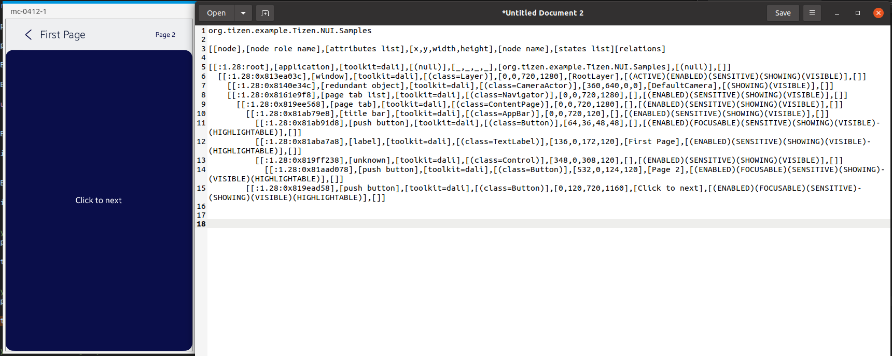

# AppBar and ContentPage

TizenFX에 있는 Tizen.NUI.Samples의 샘플을 사용하여 확인했습니다.

먼저, `AppBar`와 `ContentPage` class들을 확인하기 위해 

[AppBarSample.cs](https://github.com/Samsung/TizenFX/blob/master/test/Tizen.NUI.Samples/Tizen.NUI.Samples/Samples/AppBarSample.cs) 샘플을 통해 at-spi2-tool을 동작시켜 보았습니다.



왼쪽은 mobile emulator에서 샘플을 런칭한 화면이고, 오른쪽은 at-spi2-tool로 확인한 tree node입니다.

<br>

```
[[node],[node role name],[attributes list],[x,y,width,height],[node name],[states list][relations]

[[:1.28:root],[application],[toolkit=dali],[(null)],[_,_,_,_],[org.tizen.example.Tizen.NUI.Samples],[(null)],[]]
  [[:1.28:0x813ea03c],[window],[toolkit=dali],[(class=Layer)],[0,0,720,1280],[RootLayer],[(ACTIVE)(ENABLED)(SENSITIVE)(SHOWING)(VISIBLE)],[]]
    [[:1.28:0x8140e34c],[redundant object],[toolkit=dali],[(class=CameraActor)],[360,640,0,0],[DefaultCamera],[(SHOWING)(VISIBLE)],[]]
    [[:1.28:0x8161e9f8],[page tab list],[toolkit=dali],[(class=Navigator)],[0,0,720,1280],[],[(ENABLED)(SENSITIVE)(SHOWING)(VISIBLE)],[]]
      [[:1.28:0x819ee568],[page tab],[toolkit=dali],[(class=ContentPage)],[0,0,720,1280],[],[(ENABLED)(SENSITIVE)(SHOWING)(VISIBLE)],[]]
        [[:1.28:0x81ab79e8],[title bar],[toolkit=dali],[(class=AppBar)],[0,0,720,120],[],[(ENABLED)(SENSITIVE)(SHOWING)(VISIBLE)],[]]
          [[:1.28:0x81ab91d8],[push button],[toolkit=dali],[(class=Button)],[64,36,48,48],[],[(ENABLED)(FOCUSABLE)(SENSITIVE)(SHOWING)(VISIBLE)(HIGHLIGHTABLE)],[]]
          [[:1.28:0x81aba7a8],[label],[toolkit=dali],[(class=TextLabel)],[136,0,172,120],[First Page],[(ENABLED)(SENSITIVE)(SHOWING)(VISIBLE)(HIGHLIGHTABLE)],[]]
          [[:1.28:0x819ff238],[unknown],[toolkit=dali],[(class=Control)],[348,0,308,120],[],[(ENABLED)(SENSITIVE)(SHOWING)(VISIBLE)],[]]
            [[:1.28:0x81aad078],[push button],[toolkit=dali],[(class=Button)],[532,0,124,120],[Page 2],[(ENABLED)(FOCUSABLE)(SENSITIVE)(SHOWING)(VISIBLE)(HIGHLIGHTABLE)],[]]
        [[:1.28:0x819ead58],[push button],[toolkit=dali],[(class=Button)],[0,120,720,1160],[Click to next],[(ENABLED)(FOCUSABLE)(SENSITIVE)(SHOWING)(VISIBLE)(HIGHLIGHTABLE)],[]]
```

<br>

### `AccessibilityName`이 필요한 곳?
 : 비쥬얼 요소로 텍스트가 있는 Component

1. AppBar
     - string Title


<br>

### `AccessibilityHidden` 적용을 위해 고려할 사항

- 'First Page' TextLabel과 'Page 2' Button 사이의 Control의 정체
 
   -> `Actions` property에 set한 `View`

 우선 샘플에서 아래처럼 사용

 ``` C#
             firstActionButton = new Button()
            {
                Text = "Page 2",
            };

            firstAppBar = new AppBar()
            {
                AutoNavigationContent = false,
                Title = "First Page",
                Actions = new View[] { firstActionButton },
            };
 ```

그리고 `Actions` property에선

``` C#
        private IEnumerable<View> actionContentViews = null;

        public IEnumerable<View> Actions
        {
            get
            {
                return actionContentViews;
            }
            set
            {
                //
                actionContentViews = value;
                //
                foreach (var action in actionContentViews)
                {
                    if ((action is Button) && (actionButtonStyle != null))
                    {
                        action.ApplyStyle(actionButtonStyle);
                    }
                    else if (actionViewStyle != null)
                    {
                        action.ApplyStyle(actionViewStyle);
                    }

                    ActionContent.Add(action);
                }
            }
        }

```

Q. 이 actionContentViews, 즉, for each를 통해 나온 action 혹은 actionContent 를 tree에서 안보이게 해야할까?
```C#
        private View CreateDefaultActionContent()
        {
            return new View()
            {
                Layout = new LinearLayout()
                {
                    LinearOrientation = LinearLayout.Orientation.Horizontal,
                    LinearAlignment = LinearLayout.Alignment.End,
                },
                WidthSpecification = LayoutParamPolicies.MatchParent,
                HeightSpecification = LayoutParamPolicies.MatchParent,
            };
        }
```

A. 사용자가 추가, 수정할 수 있는 property의 View이기 때문에 at-spi2 tree에 보여야 합니다!

