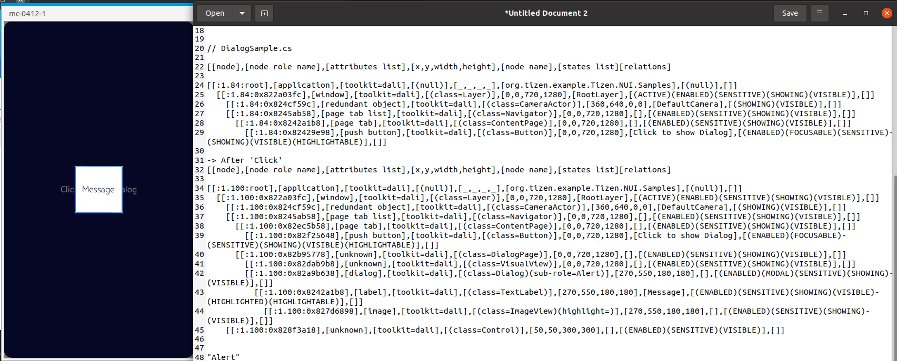

# DialogPage

TizenFX에 있는 Tizen.NUI.Samples의 샘플을 사용하여 확인했습니다.

`DialogPage` class를 확인하기 위해 

[DialogSample.cs](https://github.com/Samsung/TizenFX/blob/master/test/Tizen.NUI.Samples/Tizen.NUI.Samples/Samples/DialogSample.cs) 샘플을 통해 at-spi2-tool을 동작시켜 보았습니다.



왼쪽은 mobile emulator에서 샘플을 런칭한 화면이고, 오른쪽은 at-spi2-tool로 확인한 tree node입니다.

<br>

```
[[node],[node role name],[attributes list],[x,y,width,height],[node name],[states list][relations]

[[:1.84:root],[application],[toolkit=dali],[(null)],[_,_,_,_],[org.tizen.example.Tizen.NUI.Samples],[(null)],[]]
  [[:1.84:0x822a03fc],[window],[toolkit=dali],[(class=Layer)],[0,0,720,1280],[RootLayer],[(ACTIVE)(ENABLED)(SENSITIVE)(SHOWING)(VISIBLE)],[]]
    [[:1.84:0x824cf59c],[redundant object],[toolkit=dali],[(class=CameraActor)],[360,640,0,0],[DefaultCamera],[(SHOWING)(VISIBLE)],[]]
    [[:1.84:0x8245ab58],[page tab list],[toolkit=dali],[(class=Navigator)],[0,0,720,1280],[],[(ENABLED)(SENSITIVE)(SHOWING)(VISIBLE)],[]]
      [[:1.84:0x8242a1b8],[page tab],[toolkit=dali],[(class=ContentPage)],[0,0,720,1280],[],[(ENABLED)(SENSITIVE)(SHOWING)(VISIBLE)],[]]
        [[:1.84:0x82429e98],[push button],[toolkit=dali],[(class=Button)],[0,0,720,1280],[Click to show Dialog],[(ENABLED)(FOCUSABLE)(SENSITIVE)(SHOWING)(VISIBLE)(HIGHLIGHTABLE)],[]]

// -> After 'Click'
[[node],[node role name],[attributes list],[x,y,width,height],[node name],[states list][relations]

[[:1.100:root],[application],[toolkit=dali],[(null)],[_,_,_,_],[org.tizen.example.Tizen.NUI.Samples],[(null)],[]]
  [[:1.100:0x822a03fc],[window],[toolkit=dali],[(class=Layer)],[0,0,720,1280],[RootLayer],[(ACTIVE)(ENABLED)(SENSITIVE)(SHOWING)(VISIBLE)],[]]
    [[:1.100:0x824cf59c],[redundant object],[toolkit=dali],[(class=CameraActor)],[360,640,0,0],[DefaultCamera],[(SHOWING)(VISIBLE)],[]]
    [[:1.100:0x8245ab58],[page tab list],[toolkit=dali],[(class=Navigator)],[0,0,720,1280],[],[(ENABLED)(SENSITIVE)(SHOWING)(VISIBLE)],[]]
      [[:1.100:0x82ec5b58],[page tab],[toolkit=dali],[(class=ContentPage)],[0,0,720,1280],[],[(ENABLED)(SENSITIVE)(SHOWING)(VISIBLE)],[]]
        [[:1.100:0x82f25648],[push button],[toolkit=dali],[(class=Button)],[0,0,720,1280],[Click to show Dialog],[(ENABLED)(FOCUSABLE)(SENSITIVE)(SHOWING)(VISIBLE)(HIGHLIGHTABLE)],[]]
      [[:1.100:0x82b95778],[unknown],[toolkit=dali],[(class=DialogPage)],[0,0,720,1280],[],[(ENABLED)(SENSITIVE)(SHOWING)(VISIBLE)],[]]
        [[:1.100:0x82dab9b8],[unknown],[toolkit=dali],[(class=VisualView)],[0,0,720,1280],[],[(ENABLED)(SENSITIVE)(SHOWING)(VISIBLE)],[]]
        [[:1.100:0x82a9b638],[dialog],[toolkit=dali],[(class=Dialog)(sub-role=Alert)],[270,550,180,180],[],[(ENABLED)(MODAL)(SENSITIVE)(SHOWING)(VISIBLE)],[]]
          [[:1.100:0x8242a1b8],[label],[toolkit=dali],[(class=TextLabel)],[270,550,180,180],[Message],[(ENABLED)(SENSITIVE)(SHOWING)(VISIBLE)(HIGHLIGHTED)(HIGHLIGHTABLE)],[]]
            [[:1.100:0x827d6898],[image],[toolkit=dali],[(class=ImageView)(highlight=)],[270,550,180,180],[],[(ENABLED)(SENSITIVE)(SHOWING)(VISIBLE)],[]]
    [[:1.100:0x828f3a18],[unknown],[toolkit=dali],[(class=Control)],[50,50,300,300],[],[(ENABLED)(SENSITIVE)(VISIBLE)],[]]

```

<br>

### `AccessibilityName`이 필요한 곳?
 : 비쥬얼 요소로 텍스트가 있는 Component

1. DialogPage와 Dialog
    - 샘플에서는 DialogPage의 `ShowDialog()`에 TextLabel을 추가해주는데 이럴 경우, Dialog에서 Content가 Text class일 경우 Name을 설정해줘야 하는지...
    ```
                var textLabel = new TextLabel("Message")
                {
                    BackgroundColor = Color.White,
                    Size = new Size(180, 180),
                    HorizontalAlignment = HorizontalAlignment.Center,
                    VerticalAlignment = VerticalAlignment.Center,
                };

                DialogPage.ShowDialog(textLabel);
    ```


<br>

### `AccessibilityHidden` 적용을 위해 고려할 사항

- 'DialogPage'와 'Dialog'사이의 VisualView의 정체
  
  -> `Scrim` 이었다. 여기서 잠깐. Scrim이란 : "Scrim is the dimmed screen region behind dialog." <br>
    "A scrim is a temporary treatment that can be applied to Material surfaces for the purpose of making content on the surface less prominent."
  ```C#
          private View CreateDefaultScrim()
        {
            var scrim = new VisualView(scrimStyle);
            scrim.Size = NUIApplication.GetDefaultWindow().Size;
            return scrim;
        }
  ```
  Q. 이 scrim은 tree에서 안보이게 해도 될듯?

  A. 사용자가 추가, 수정할 수 있는 property의 View이기 때문에 at-spi2 tree에 보여야 합니다!
