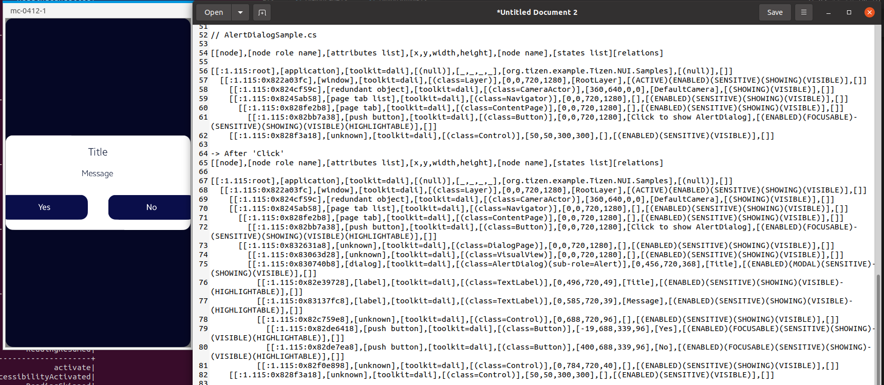

# AlertDialog

TizenFX에 있는 Tizen.NUI.Samples의 샘플을 사용하여 확인했습니다.

`AlertDialog` class를 확인하기 위해 

[AlertDialogSample.cs](https://github.com/Samsung/TizenFX/blob/master/test/Tizen.NUI.Samples/Tizen.NUI.Samples/Samples/AlertDialogSample.cs) 샘플을 통해 at-spi2-tool을 동작시켜 보았습니다.



왼쪽은 mobile emulator에서 샘플을 런칭한 화면이고, 오른쪽은 at-spi2-tool로 확인한 tree node입니다.

<br>

```
[[node],[node role name],[attributes list],[x,y,width,height],[node name],[states list][relations]

[[:1.115:root],[application],[toolkit=dali],[(null)],[_,_,_,_],[org.tizen.example.Tizen.NUI.Samples],[(null)],[]]
  [[:1.115:0x822a03fc],[window],[toolkit=dali],[(class=Layer)],[0,0,720,1280],[RootLayer],[(ACTIVE)(ENABLED)(SENSITIVE)(SHOWING)(VISIBLE)],[]]
    [[:1.115:0x824cf59c],[redundant object],[toolkit=dali],[(class=CameraActor)],[360,640,0,0],[DefaultCamera],[(SHOWING)(VISIBLE)],[]]
    [[:1.115:0x8245ab58],[page tab list],[toolkit=dali],[(class=Navigator)],[0,0,720,1280],[],[(ENABLED)(SENSITIVE)(SHOWING)(VISIBLE)],[]]
      [[:1.115:0x828fe2b8],[page tab],[toolkit=dali],[(class=ContentPage)],[0,0,720,1280],[],[(ENABLED)(SENSITIVE)(SHOWING)(VISIBLE)],[]]
        [[:1.115:0x82bb7a38],[push button],[toolkit=dali],[(class=Button)],[0,0,720,1280],[Click to show AlertDialog],[(ENABLED)(FOCUSABLE)(SENSITIVE)(SHOWING)(VISIBLE)(HIGHLIGHTABLE)],[]]
    [[:1.115:0x828f3a18],[unknown],[toolkit=dali],[(class=Control)],[50,50,300,300],[],[(ENABLED)(SENSITIVE)(VISIBLE)],[]]

// -> After 'Click'
[[node],[node role name],[attributes list],[x,y,width,height],[node name],[states list][relations]

[[:1.115:root],[application],[toolkit=dali],[(null)],[_,_,_,_],[org.tizen.example.Tizen.NUI.Samples],[(null)],[]]
  [[:1.115:0x822a03fc],[window],[toolkit=dali],[(class=Layer)],[0,0,720,1280],[RootLayer],[(ACTIVE)(ENABLED)(SENSITIVE)(SHOWING)(VISIBLE)],[]]
    [[:1.115:0x824cf59c],[redundant object],[toolkit=dali],[(class=CameraActor)],[360,640,0,0],[DefaultCamera],[(SHOWING)(VISIBLE)],[]]
    [[:1.115:0x8245ab58],[page tab list],[toolkit=dali],[(class=Navigator)],[0,0,720,1280],[],[(ENABLED)(SENSITIVE)(SHOWING)(VISIBLE)],[]]
      [[:1.115:0x828fe2b8],[page tab],[toolkit=dali],[(class=ContentPage)],[0,0,720,1280],[],[(ENABLED)(SENSITIVE)(SHOWING)(VISIBLE)],[]]
        [[:1.115:0x82bb7a38],[push button],[toolkit=dali],[(class=Button)],[0,0,720,1280],[Click to show AlertDialog],[(ENABLED)(FOCUSABLE)(SENSITIVE)(SHOWING)(VISIBLE)(HIGHLIGHTABLE)],[]]
      [[:1.115:0x832631a8],[unknown],[toolkit=dali],[(class=DialogPage)],[0,0,720,1280],[],[(ENABLED)(SENSITIVE)(SHOWING)(VISIBLE)],[]]
        [[:1.115:0x83063d28],[unknown],[toolkit=dali],[(class=VisualView)],[0,0,720,1280],[],[(ENABLED)(SENSITIVE)(SHOWING)(VISIBLE)],[]]
        [[:1.115:0x830740b8],[dialog],[toolkit=dali],[(class=AlertDialog)(sub-role=Alert)],[0,456,720,368],[Title],[(ENABLED)(MODAL)(SENSITIVE)(SHOWING)(VISIBLE)],[]]
          [[:1.115:0x82e39728],[label],[toolkit=dali],[(class=TextLabel)],[0,496,720,49],[Title],[(ENABLED)(SENSITIVE)(SHOWING)(VISIBLE)(HIGHLIGHTABLE)],[]]
          [[:1.115:0x83137fc8],[label],[toolkit=dali],[(class=TextLabel)],[0,585,720,39],[Message],[(ENABLED)(SENSITIVE)(SHOWING)(VISIBLE)(HIGHLIGHTABLE)],[]]
          [[:1.115:0x82c759e8],[unknown],[toolkit=dali],[(class=Control)],[0,688,720,96],[],[(ENABLED)(SENSITIVE)(SHOWING)(VISIBLE)],[]]
            [[:1.115:0x82de6418],[push button],[toolkit=dali],[(class=Button)],[-19,688,339,96],[Yes],[(ENABLED)(FOCUSABLE)(SENSITIVE)(SHOWING)(VISIBLE)(HIGHLIGHTABLE)],[]]
            [[:1.115:0x82de7ea8],[push button],[toolkit=dali],[(class=Button)],[400,688,339,96],[No],[(ENABLED)(FOCUSABLE)(SENSITIVE)(SHOWING)(VISIBLE)(HIGHLIGHTABLE)],[]]
          [[:1.115:0x82f0e898],[unknown],[toolkit=dali],[(class=Control)],[0,784,720,40],[],[(ENABLED)(SENSITIVE)(SHOWING)(VISIBLE)],[]]
    [[:1.115:0x828f3a18],[unknown],[toolkit=dali],[(class=Control)],[50,50,300,300],[],[(ENABLED)(SENSITIVE)(VISIBLE)],[]]

```

<br>

### `AccessibilityName`이 필요한 곳?
 : 비쥬얼 요소로 텍스트가 있는 Component

1. string Title

2. string Message

- 샘플에서는 DialogPage의 `ShowAlertDialog()`에 Title과 Message를 추가해주는데, 어떤 것을 Name을 설정해줘야 하는지...

    ```
        DialogPage.ShowAlertDialog("Title", "Message", positiveButton, negativeButton);
    ```

    ```
        public static void ShowAlertDialog(string title, string message, params View[] actions)
        {
            var dialogPage = new DialogPage()
            {
                Content = new AlertDialog()
                {
                    Title = title,
                    Message = message,
                    Actions =  actions,
                },
            };
        }
    ```

- 우선 Title이 Name / Message를 Description으로 하는게 어떨지!


<br>

### `AccessibilityHidden` 적용을 위해 고려할 사항

- Button 클릭 전, 'Click to show AlertDialog` Button 다음에 있는 Control의 정체
- 'DialogPage'와 'AlertDialog'사이의 VisualView의 정체 및 사용 여부 확인 필요
- Yes / No Button들 다음에 있는 Control 2개의 정체!

