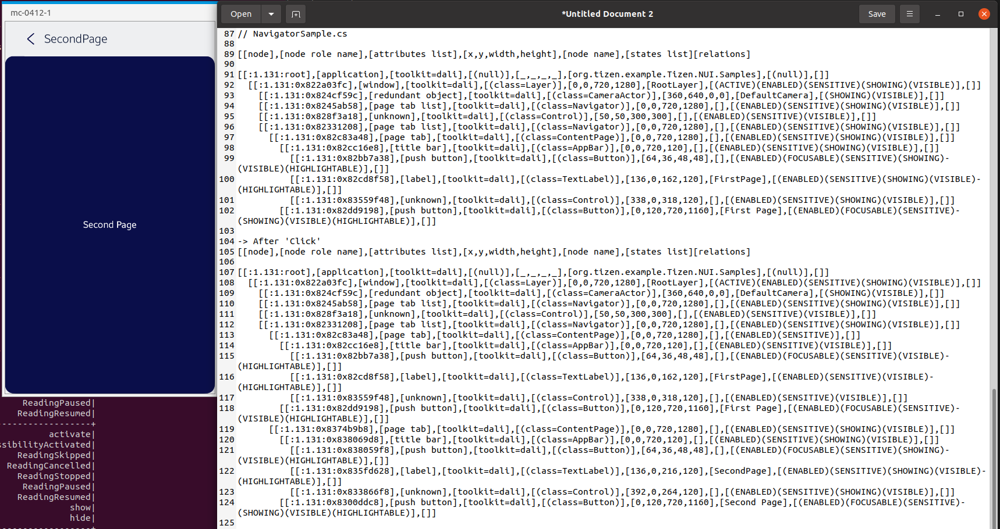

# Navigator

TizenFX에 있는 Tizen.NUI.Samples의 샘플을 사용하여 확인했습니다.

`Navigator` class를 확인하기 위해 

[NavigatorSample.cs](https://github.com/Samsung/TizenFX/blob/master/test/Tizen.NUI.Samples/Tizen.NUI.Samples/Samples/NavigatorSample.cs) 샘플을 통해 at-spi2-tool을 동작시켜 보았습니다.



왼쪽은 mobile emulator에서 샘플을 런칭한 화면이고, 오른쪽은 at-spi2-tool로 확인한 tree node입니다.

```
[[node],[node role name],[attributes list],[x,y,width,height],[node name],[states list][relations]

[[:1.131:root],[application],[toolkit=dali],[(null)],[_,_,_,_],[org.tizen.example.Tizen.NUI.Samples],[(null)],[]]
  [[:1.131:0x822a03fc],[window],[toolkit=dali],[(class=Layer)],[0,0,720,1280],[RootLayer],[(ACTIVE)(ENABLED)(SENSITIVE)(SHOWING)(VISIBLE)],[]]
    [[:1.131:0x824cf59c],[redundant object],[toolkit=dali],[(class=CameraActor)],[360,640,0,0],[DefaultCamera],[(SHOWING)(VISIBLE)],[]]
    [[:1.131:0x8245ab58],[page tab list],[toolkit=dali],[(class=Navigator)],[0,0,720,1280],[],[(ENABLED)(SENSITIVE)(SHOWING)(VISIBLE)],[]]
    [[:1.131:0x828f3a18],[unknown],[toolkit=dali],[(class=Control)],[50,50,300,300],[],[(ENABLED)(SENSITIVE)(VISIBLE)],[]]
    [[:1.131:0x82331208],[page tab list],[toolkit=dali],[(class=Navigator)],[0,0,720,1280],[],[(ENABLED)(SENSITIVE)(SHOWING)(VISIBLE)],[]]
      [[:1.131:0x82c83a48],[page tab],[toolkit=dali],[(class=ContentPage)],[0,0,720,1280],[],[(ENABLED)(SENSITIVE)(SHOWING)(VISIBLE)],[]]
        [[:1.131:0x82cc16e8],[title bar],[toolkit=dali],[(class=AppBar)],[0,0,720,120],[],[(ENABLED)(SENSITIVE)(SHOWING)(VISIBLE)],[]]
          [[:1.131:0x82bb7a38],[push button],[toolkit=dali],[(class=Button)],[64,36,48,48],[],[(ENABLED)(FOCUSABLE)(SENSITIVE)(SHOWING)(VISIBLE)(HIGHLIGHTABLE)],[]]
          [[:1.131:0x82cd8f58],[label],[toolkit=dali],[(class=TextLabel)],[136,0,162,120],[FirstPage],[(ENABLED)(SENSITIVE)(SHOWING)(VISIBLE)(HIGHLIGHTABLE)],[]]
          [[:1.131:0x83559f48],[unknown],[toolkit=dali],[(class=Control)],[338,0,318,120],[],[(ENABLED)(SENSITIVE)(SHOWING)(VISIBLE)],[]]
        [[:1.131:0x82dd9198],[push button],[toolkit=dali],[(class=Button)],[0,120,720,1160],[First Page],[(ENABLED)(FOCUSABLE)(SENSITIVE)(SHOWING)(VISIBLE)(HIGHLIGHTABLE)],[]]

// -> After 'Click'
[[node],[node role name],[attributes list],[x,y,width,height],[node name],[states list][relations]

[[:1.131:root],[application],[toolkit=dali],[(null)],[_,_,_,_],[org.tizen.example.Tizen.NUI.Samples],[(null)],[]]
  [[:1.131:0x822a03fc],[window],[toolkit=dali],[(class=Layer)],[0,0,720,1280],[RootLayer],[(ACTIVE)(ENABLED)(SENSITIVE)(SHOWING)(VISIBLE)],[]]
    [[:1.131:0x824cf59c],[redundant object],[toolkit=dali],[(class=CameraActor)],[360,640,0,0],[DefaultCamera],[(SHOWING)(VISIBLE)],[]]
    [[:1.131:0x8245ab58],[page tab list],[toolkit=dali],[(class=Navigator)],[0,0,720,1280],[],[(ENABLED)(SENSITIVE)(SHOWING)(VISIBLE)],[]]
    [[:1.131:0x828f3a18],[unknown],[toolkit=dali],[(class=Control)],[50,50,300,300],[],[(ENABLED)(SENSITIVE)(VISIBLE)],[]]
    [[:1.131:0x82331208],[page tab list],[toolkit=dali],[(class=Navigator)],[0,0,720,1280],[],[(ENABLED)(SENSITIVE)(SHOWING)(VISIBLE)],[]]
      [[:1.131:0x82c83a48],[page tab],[toolkit=dali],[(class=ContentPage)],[0,0,720,1280],[],[(ENABLED)(SENSITIVE)],[]]
        [[:1.131:0x82cc16e8],[title bar],[toolkit=dali],[(class=AppBar)],[0,0,720,120],[],[(ENABLED)(SENSITIVE)(VISIBLE)],[]]
          [[:1.131:0x82bb7a38],[push button],[toolkit=dali],[(class=Button)],[64,36,48,48],[],[(ENABLED)(FOCUSABLE)(SENSITIVE)(VISIBLE)(HIGHLIGHTABLE)],[]]
          [[:1.131:0x82cd8f58],[label],[toolkit=dali],[(class=TextLabel)],[136,0,162,120],[FirstPage],[(ENABLED)(SENSITIVE)(VISIBLE)(HIGHLIGHTABLE)],[]]
          [[:1.131:0x83559f48],[unknown],[toolkit=dali],[(class=Control)],[338,0,318,120],[],[(ENABLED)(SENSITIVE)(VISIBLE)],[]]
        [[:1.131:0x82dd9198],[push button],[toolkit=dali],[(class=Button)],[0,120,720,1160],[First Page],[(ENABLED)(FOCUSABLE)(SENSITIVE)(VISIBLE)(HIGHLIGHTABLE)],[]]
      [[:1.131:0x8374b9b8],[page tab],[toolkit=dali],[(class=ContentPage)],[0,0,720,1280],[],[(ENABLED)(SENSITIVE)(SHOWING)(VISIBLE)],[]]
        [[:1.131:0x838069d8],[title bar],[toolkit=dali],[(class=AppBar)],[0,0,720,120],[],[(ENABLED)(SENSITIVE)(SHOWING)(VISIBLE)],[]]
          [[:1.131:0x838059f8],[push button],[toolkit=dali],[(class=Button)],[64,36,48,48],[],[(ENABLED)(FOCUSABLE)(SENSITIVE)(SHOWING)(VISIBLE)(HIGHLIGHTABLE)],[]]
          [[:1.131:0x835fd628],[label],[toolkit=dali],[(class=TextLabel)],[136,0,216,120],[SecondPage],[(ENABLED)(SENSITIVE)(SHOWING)(VISIBLE)(HIGHLIGHTABLE)],[]]
          [[:1.131:0x833866f8],[unknown],[toolkit=dali],[(class=Control)],[392,0,264,120],[],[(ENABLED)(SENSITIVE)(SHOWING)(VISIBLE)],[]]
        [[:1.131:0x8300ddc8],[push button],[toolkit=dali],[(class=Button)],[0,120,720,1160],[Second Page],[(ENABLED)(FOCUSABLE)(SENSITIVE)(SHOWING)(VISIBLE)(HIGHLIGHTABLE)],[]]

```

<br>

### `AccessibilityName`이 필요한 곳?
 : 비쥬얼 요소로 텍스트가 있는 Component

- N/A

<br>

### `AccessibilityHidden` 적용을 위해 고려할 사항

- Navigator가 두개인 이유와 그 사이 Control의 정체

  -> 두 개인 이유 : (추측) app에서 생성하는 Navigator와 Default Navigator가 두 번 생성되기 때문에
  ```C#
        public static Navigator GetDefaultNavigator(Window window)
        {
            var defaultNavigator = new Navigator();
            defaultNavigator.WidthResizePolicy = ResizePolicyType.FillToParent;
            defaultNavigator.HeightResizePolicy = ResizePolicyType.FillToParent;
            window.Add(defaultNavigator);
            windowNavigator.Add(window, defaultNavigator);
            navigatorWindow.Add(defaultNavigator, window);

            return defaultNavigator;
        }
  ```
  Q. 두 개 모두 유지?

  A. DefaultNavigator가 보이는 이유는, Sample에서 각 아이템을 보이기 위한 main에서 사용되기 때문입니다.

    그렇기 때문에 Default Navigator 역시 tree에서 보여야 합니다.


- 'FirstPage' TextLabel과 'First Page' Button 사이의 Control의 정체 및 사용 여부 확인 필요

  -> `AppBar`와 동일하게 유지
