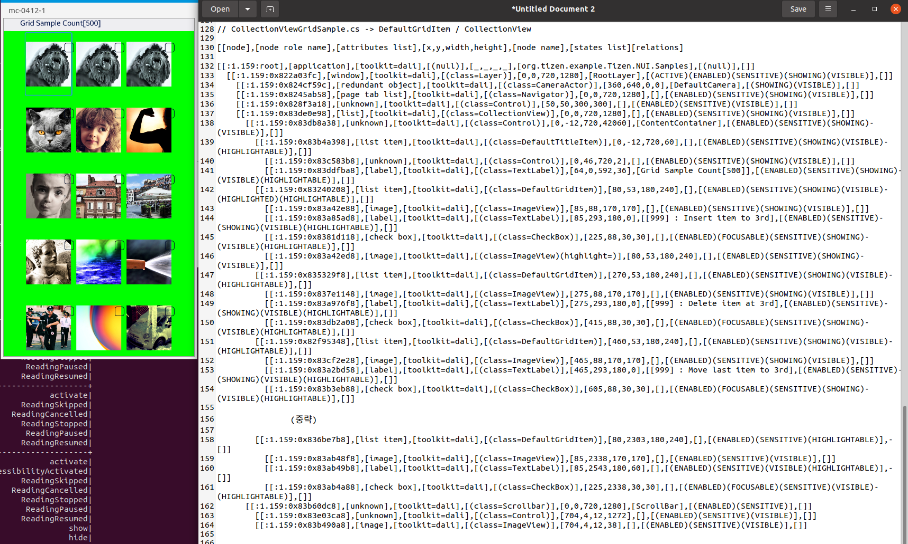

# DefaultGridItem

TizenFX에 있는 Tizen.NUI.Samples의 샘플을 사용하여 확인했습니다.

`DefaultGridItem`과 `CollectionView` class들을 확인하기 위해 

[CollectionViewGridSample.cs](https://github.com/Samsung/TizenFX/blob/master/test/Tizen.NUI.Samples/Tizen.NUI.Samples/Samples/CollectionViewDemo/CollectionViewGridSample.cs) 샘플을 통해 at-spi2-tool을 동작시켜 보았습니다.



왼쪽은 mobile emulator에서 샘플을 런칭한 화면이고, 오른쪽은 at-spi2-tool로 확인한 tree node입니다.

<br>

```
[[node],[node role name],[attributes list],[x,y,width,height],[node name],[states list][relations]

[[:1.159:root],[application],[toolkit=dali],[(null)],[_,_,_,_],[org.tizen.example.Tizen.NUI.Samples],[(null)],[]]
  [[:1.159:0x822a03fc],[window],[toolkit=dali],[(class=Layer)],[0,0,720,1280],[RootLayer],[(ACTIVE)(ENABLED)(SENSITIVE)(SHOWING)(VISIBLE)],[]]
    [[:1.159:0x824cf59c],[redundant object],[toolkit=dali],[(class=CameraActor)],[360,640,0,0],[DefaultCamera],[(SHOWING)(VISIBLE)],[]]
    [[:1.159:0x8245ab58],[page tab list],[toolkit=dali],[(class=Navigator)],[0,0,720,1280],[],[(ENABLED)(SENSITIVE)(SHOWING)(VISIBLE)],[]]
    [[:1.159:0x828f3a18],[unknown],[toolkit=dali],[(class=Control)],[50,50,300,300],[],[(ENABLED)(SENSITIVE)(VISIBLE)],[]]
    [[:1.159:0x83de0e98],[list],[toolkit=dali],[(class=CollectionView)],[0,0,720,1280],[],[(ENABLED)(SENSITIVE)(SHOWING)(VISIBLE)],[]]
      [[:1.159:0x83db8a38],[unknown],[toolkit=dali],[(class=Control)],[0,-12,720,42060],[ContentContainer],[(ENABLED)(SENSITIVE)(SHOWING)(VISIBLE)],[]]
        [[:1.159:0x83b4a398],[list item],[toolkit=dali],[(class=DefaultTitleItem)],[0,-12,720,60],[],[(ENABLED)(SENSITIVE)(SHOWING)(VISIBLE)(HIGHLIGHTABLE)],[]]
          [[:1.159:0x83c583b8],[unknown],[toolkit=dali],[(class=Control)],[0,46,720,2],[],[(ENABLED)(SENSITIVE)(SHOWING)(VISIBLE)],[]]
          [[:1.159:0x83ddfba8],[label],[toolkit=dali],[(class=TextLabel)],[64,0,592,36],[Grid Sample Count[500]],[(ENABLED)(SENSITIVE)(SHOWING)(VISIBLE)(HIGHLIGHTABLE)],[]]
        [[:1.159:0x83240208],[list item],[toolkit=dali],[(class=DefaultGridItem)],[80,53,180,240],[],[(ENABLED)(SENSITIVE)(SHOWING)(VISIBLE)(HIGHLIGHTED)(HIGHLIGHTABLE)],[]]
          [[:1.159:0x83a42e88],[image],[toolkit=dali],[(class=ImageView)],[85,88,170,170],[],[(ENABLED)(SENSITIVE)(SHOWING)(VISIBLE)],[]]
          [[:1.159:0x83a85ad8],[label],[toolkit=dali],[(class=TextLabel)],[85,293,180,0],[[999] : Insert item to 3rd],[(ENABLED)(SENSITIVE)(SHOWING)(VISIBLE)(HIGHLIGHTABLE)],[]]
          [[:1.159:0x8381d118],[check box],[toolkit=dali],[(class=CheckBox)],[225,88,30,30],[],[(ENABLED)(FOCUSABLE)(SENSITIVE)(SHOWING)(VISIBLE)(HIGHLIGHTABLE)],[]]
          [[:1.159:0x83a42ed8],[image],[toolkit=dali],[(class=ImageView)(highlight=)],[80,53,180,240],[],[(ENABLED)(SENSITIVE)(SHOWING)(VISIBLE)],[]]
        [[:1.159:0x835329f8],[list item],[toolkit=dali],[(class=DefaultGridItem)],[270,53,180,240],[],[(ENABLED)(SENSITIVE)(SHOWING)(VISIBLE)(HIGHLIGHTABLE)],[]]
          [[:1.159:0x837e1148],[image],[toolkit=dali],[(class=ImageView)],[275,88,170,170],[],[(ENABLED)(SENSITIVE)(SHOWING)(VISIBLE)],[]]
          [[:1.159:0x83a976f8],[label],[toolkit=dali],[(class=TextLabel)],[275,293,180,0],[[999] : Delete item at 3rd],[(ENABLED)(SENSITIVE)(SHOWING)(VISIBLE)(HIGHLIGHTABLE)],[]]
          [[:1.159:0x83db2a08],[check box],[toolkit=dali],[(class=CheckBox)],[415,88,30,30],[],[(ENABLED)(FOCUSABLE)(SENSITIVE)(SHOWING)(VISIBLE)(HIGHLIGHTABLE)],[]]
        [[:1.159:0x82f95348],[list item],[toolkit=dali],[(class=DefaultGridItem)],[460,53,180,240],[],[(ENABLED)(SENSITIVE)(SHOWING)(VISIBLE)(HIGHLIGHTABLE)],[]]
          [[:1.159:0x83cf2e28],[image],[toolkit=dali],[(class=ImageView)],[465,88,170,170],[],[(ENABLED)(SENSITIVE)(SHOWING)(VISIBLE)],[]]
          [[:1.159:0x83a2bd58],[label],[toolkit=dali],[(class=TextLabel)],[465,293,180,0],[[999] : Move last item to 3rd],[(ENABLED)(SENSITIVE)(SHOWING)(VISIBLE)(HIGHLIGHTABLE)],[]]
          [[:1.159:0x83b3eb88],[check box],[toolkit=dali],[(class=CheckBox)],[605,88,30,30],[],[(ENABLED)(FOCUSABLE)(SENSITIVE)(SHOWING)(VISIBLE)(HIGHLIGHTABLE)],[]]

		(중략)

        [[:1.159:0x836be7b8],[list item],[toolkit=dali],[(class=DefaultGridItem)],[80,2303,180,240],[],[(ENABLED)(SENSITIVE)(HIGHLIGHTABLE)],[]]
          [[:1.159:0x83ab48f8],[image],[toolkit=dali],[(class=ImageView)],[85,2338,170,170],[],[(ENABLED)(SENSITIVE)(VISIBLE)],[]]
          [[:1.159:0x83ab49b8],[label],[toolkit=dali],[(class=TextLabel)],[85,2543,180,60],[],[(ENABLED)(SENSITIVE)(VISIBLE)(HIGHLIGHTABLE)],[]]
          [[:1.159:0x83ab4a88],[check box],[toolkit=dali],[(class=CheckBox)],[225,2338,30,30],[],[(ENABLED)(FOCUSABLE)(SENSITIVE)(VISIBLE)(HIGHLIGHTABLE)],[]]
      [[:1.159:0x83b60dc8],[unknown],[toolkit=dali],[(class=Scrollbar)],[0,0,720,1280],[ScrollBar],[(ENABLED)(SENSITIVE)],[]]
        [[:1.159:0x83e03ca8],[unknown],[toolkit=dali],[(class=Control)],[704,4,12,1272],[],[(ENABLED)(SENSITIVE)(VISIBLE)],[]]
        [[:1.159:0x83b490a8],[image],[toolkit=dali],[(class=ImageView)],[704,4,12,38],[],[(ENABLED)(SENSITIVE)(VISIBLE)],[]]

```

<br>

### `AccessibilityName`이 필요한 곳?
 : 비쥬얼 요소로 텍스트가 있는 Component

1. DefaultGridItem
     - string Text 혹은 TextLabel Label -> 내부적으로 TextLabel 타입인, Label의 text에 string을 set함

<br>

### `AccessibilityHidden` 적용을 위해 고려할 사항

- DefaultGridItem의 경우, 보이는 부분만 tree에 나오게

  **-> 이미 화면에 보이는 item + 약간의 추가 item만 생성되는 구현이기 때문에 모두 tree에 보여도 괜찮습니다.**

    -> 실제로 해당 샘플에서 화면에 보이는 item은 15개 / tree에 추가된 item은 25개.

- 그 외엔 마지막에 달려있는 Scrollbar와 Control, ImageView의 역할 확인

  -> trackView에 해당하는 Control만 보이지 않게 Hidden 추가
  (https://github.com/Samsung/TizenFX/pull/4169)

