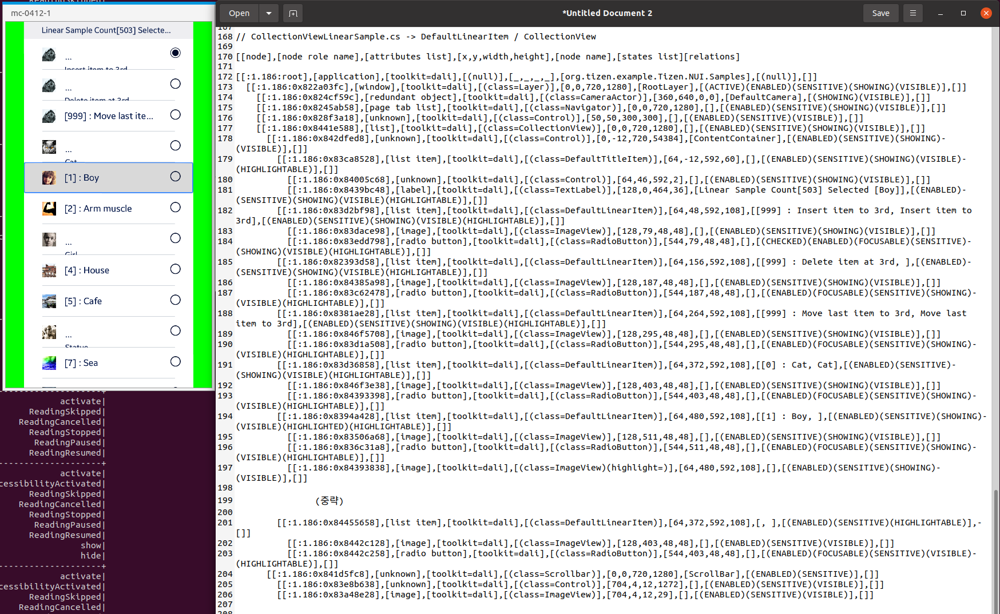

# DefaultLinearItem

TizenFX에 있는 Tizen.NUI.Samples의 샘플을 사용하여 확인했습니다.

`DefaultLinearItem`과 `CollectionView` class들을 확인하기 위해 

[CollectionViewLinearSample.cs](https://github.com/Samsung/TizenFX/blob/master/test/Tizen.NUI.Samples/Tizen.NUI.Samples/Samples/CollectionViewDemo/CollectionViewLinearSample.cs) 샘플을 통해 at-spi2-tool을 동작시켜 보았습니다.



왼쪽은 mobile emulator에서 샘플을 런칭한 화면이고, 오른쪽은 at-spi2-tool로 확인한 tree node입니다.

<br>

```
[[node],[node role name],[attributes list],[x,y,width,height],[node name],[states list][relations]

[[:1.186:root],[application],[toolkit=dali],[(null)],[_,_,_,_],[org.tizen.example.Tizen.NUI.Samples],[(null)],[]]
  [[:1.186:0x822a03fc],[window],[toolkit=dali],[(class=Layer)],[0,0,720,1280],[RootLayer],[(ACTIVE)(ENABLED)(SENSITIVE)(SHOWING)(VISIBLE)],[]]
    [[:1.186:0x824cf59c],[redundant object],[toolkit=dali],[(class=CameraActor)],[360,640,0,0],[DefaultCamera],[(SHOWING)(VISIBLE)],[]]
    [[:1.186:0x8245ab58],[page tab list],[toolkit=dali],[(class=Navigator)],[0,0,720,1280],[],[(ENABLED)(SENSITIVE)(SHOWING)(VISIBLE)],[]]
    [[:1.186:0x828f3a18],[unknown],[toolkit=dali],[(class=Control)],[50,50,300,300],[],[(ENABLED)(SENSITIVE)(VISIBLE)],[]]
    [[:1.186:0x8441e588],[list],[toolkit=dali],[(class=CollectionView)],[0,0,720,1280],[],[(ENABLED)(SENSITIVE)(SHOWING)(VISIBLE)],[]]
      [[:1.186:0x842dfed8],[unknown],[toolkit=dali],[(class=Control)],[0,-12,720,54384],[ContentContainer],[(ENABLED)(SENSITIVE)(SHOWING)(VISIBLE)],[]]
        [[:1.186:0x83ca8528],[list item],[toolkit=dali],[(class=DefaultTitleItem)],[64,-12,592,60],[],[(ENABLED)(SENSITIVE)(SHOWING)(VISIBLE)(HIGHLIGHTABLE)],[]]
          [[:1.186:0x84005c68],[unknown],[toolkit=dali],[(class=Control)],[64,46,592,2],[],[(ENABLED)(SENSITIVE)(SHOWING)(VISIBLE)],[]]
          [[:1.186:0x8439bc48],[label],[toolkit=dali],[(class=TextLabel)],[128,0,464,36],[Linear Sample Count[503] Selected [Boy]],[(ENABLED)(SENSITIVE)(SHOWING)(VISIBLE)(HIGHLIGHTABLE)],[]]
        [[:1.186:0x83d2bf98],[list item],[toolkit=dali],[(class=DefaultLinearItem)],[64,48,592,108],[[999] : Insert item to 3rd, Insert item to 3rd],[(ENABLED)(SENSITIVE)(SHOWING)(VISIBLE)(HIGHLIGHTABLE)],[]]
          [[:1.186:0x83dace98],[image],[toolkit=dali],[(class=ImageView)],[128,79,48,48],[],[(ENABLED)(SENSITIVE)(SHOWING)(VISIBLE)],[]]
          [[:1.186:0x83edd798],[radio button],[toolkit=dali],[(class=RadioButton)],[544,79,48,48],[],[(CHECKED)(ENABLED)(FOCUSABLE)(SENSITIVE)(SHOWING)(VISIBLE)(HIGHLIGHTABLE)],[]]
        [[:1.186:0x82393d58],[list item],[toolkit=dali],[(class=DefaultLinearItem)],[64,156,592,108],[[999] : Delete item at 3rd, ],[(ENABLED)(SENSITIVE)(SHOWING)(VISIBLE)(HIGHLIGHTABLE)],[]]
          [[:1.186:0x84385a98],[image],[toolkit=dali],[(class=ImageView)],[128,187,48,48],[],[(ENABLED)(SENSITIVE)(SHOWING)(VISIBLE)],[]]
          [[:1.186:0x83c62478],[radio button],[toolkit=dali],[(class=RadioButton)],[544,187,48,48],[],[(ENABLED)(FOCUSABLE)(SENSITIVE)(SHOWING)(VISIBLE)(HIGHLIGHTABLE)],[]]
        [[:1.186:0x8381ae28],[list item],[toolkit=dali],[(class=DefaultLinearItem)],[64,264,592,108],[[999] : Move last item to 3rd, Move last item to 3rd],[(ENABLED)(SENSITIVE)(SHOWING)(VISIBLE)(HIGHLIGHTABLE)],[]]
          [[:1.186:0x846f5708],[image],[toolkit=dali],[(class=ImageView)],[128,295,48,48],[],[(ENABLED)(SENSITIVE)(SHOWING)(VISIBLE)],[]]
          [[:1.186:0x83d1a508],[radio button],[toolkit=dali],[(class=RadioButton)],[544,295,48,48],[],[(ENABLED)(FOCUSABLE)(SENSITIVE)(SHOWING)(VISIBLE)(HIGHLIGHTABLE)],[]]
        [[:1.186:0x83d36858],[list item],[toolkit=dali],[(class=DefaultLinearItem)],[64,372,592,108],[[0] : Cat, Cat],[(ENABLED)(SENSITIVE)(SHOWING)(VISIBLE)(HIGHLIGHTABLE)],[]]
          [[:1.186:0x846f3e38],[image],[toolkit=dali],[(class=ImageView)],[128,403,48,48],[],[(ENABLED)(SENSITIVE)(SHOWING)(VISIBLE)],[]]
          [[:1.186:0x84393398],[radio button],[toolkit=dali],[(class=RadioButton)],[544,403,48,48],[],[(ENABLED)(FOCUSABLE)(SENSITIVE)(SHOWING)(VISIBLE)(HIGHLIGHTABLE)],[]]
        [[:1.186:0x8394a428],[list item],[toolkit=dali],[(class=DefaultLinearItem)],[64,480,592,108],[[1] : Boy, ],[(ENABLED)(SENSITIVE)(SHOWING)(VISIBLE)(HIGHLIGHTED)(HIGHLIGHTABLE)],[]]
          [[:1.186:0x83506a68],[image],[toolkit=dali],[(class=ImageView)],[128,511,48,48],[],[(ENABLED)(SENSITIVE)(SHOWING)(VISIBLE)],[]]
          [[:1.186:0x836c31a8],[radio button],[toolkit=dali],[(class=RadioButton)],[544,511,48,48],[],[(ENABLED)(FOCUSABLE)(SENSITIVE)(SHOWING)(VISIBLE)(HIGHLIGHTABLE)],[]]
          [[:1.186:0x84393838],[image],[toolkit=dali],[(class=ImageView)(highlight=)],[64,480,592,108],[],[(ENABLED)(SENSITIVE)(SHOWING)(VISIBLE)],[]]

		(중략)

        [[:1.186:0x84455658],[list item],[toolkit=dali],[(class=DefaultLinearItem)],[64,372,592,108],[, ],[(ENABLED)(SENSITIVE)(HIGHLIGHTABLE)],[]]
          [[:1.186:0x8442c128],[image],[toolkit=dali],[(class=ImageView)],[128,403,48,48],[],[(ENABLED)(SENSITIVE)(VISIBLE)],[]]
          [[:1.186:0x8442c258],[radio button],[toolkit=dali],[(class=RadioButton)],[544,403,48,48],[],[(ENABLED)(FOCUSABLE)(SENSITIVE)(VISIBLE)(HIGHLIGHTABLE)],[]]
      [[:1.186:0x841d5fc8],[unknown],[toolkit=dali],[(class=Scrollbar)],[0,0,720,1280],[ScrollBar],[(ENABLED)(SENSITIVE)],[]]
        [[:1.186:0x83e8b638],[unknown],[toolkit=dali],[(class=Control)],[704,4,12,1272],[],[(ENABLED)(SENSITIVE)(VISIBLE)],[]]
        [[:1.186:0x83a48e28],[image],[toolkit=dali],[(class=ImageView)],[704,4,12,29],[],[(ENABLED)(SENSITIVE)(VISIBLE)],[]]

```

<br>

### `AccessibilityName`이 필요한 곳?
 : 비쥬얼 요소로 텍스트가 있는 Component

1. DefaultLinearItem
     - string Text 혹은 TextLabel Label -> 내부적으로 TextLabel 타입인, Label의 text에 string을 set함
     - string SubText 혹은 TextLabel SubLabel

- Label과 SubLabel이 Name

<br>

### `AccessibilityHidden` 적용을 위해 고려할 사항

- 현재 : `Seperator` property와 `Label`과 `SubLabel`에 적용되어 있음

- DefaultLinearItem 경우, 보이는 부분만 tree에 나오게

  **-> 이미 화면에 보이는 item + 약간의 추가 item만 생성되는 구현이기 때문에 모두 tree에 보여도 괜찮습니다.**

- 그 외엔 마지막에 달려있는 Scrollbar와 Control, ImageView의 역할 확인

  -> trackView에 해당하는 Control만 보이지 않게 Hidden 추가
  (https://github.com/Samsung/TizenFX/pull/4169)
