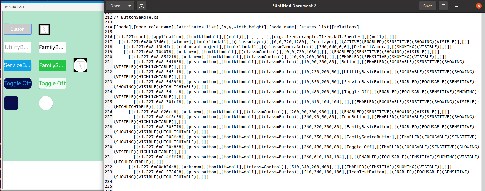

# Button

TizenFX에 있는 Tizen.NUI.Samples의 샘플을 사용하여 확인했습니다.

`Button` class를 확인하기 위해 

[ButtonSample.cs](https://github.com/Samsung/TizenFX/blob/master/test/Tizen.NUI.Samples/Tizen.NUI.Samples/Samples/ButtonSample.cs) 샘플을 통해 at-spi2-tool을 동작시켜 보았습니다.



왼쪽은 mobile emulator에서 샘플을 런칭한 화면이고, 오른쪽은 at-spi2-tool로 확인한 tree node입니다.

<br>

```
[[node],[node role name],[attributes list],[x,y,width,height],[node name],[states list][relations]

[[:1.227:root],[application],[toolkit=dali],[(null)],[_,_,_,_],[org.tizen.example.Tizen.NUI.Samples],[(null)],[]]
  [[:1.227:0x80d33d0c],[window],[toolkit=dali],[(class=Layer)],[0,0,720,1280],[RootLayer],[(ACTIVE)(ENABLED)(SENSITIVE)(SHOWING)(VISIBLE)],[]]
    [[:1.227:0x8113b4fc],[redundant object],[toolkit=dali],[(class=CameraActor)],[360,640,0,0],[DefaultCamera],[(SHOWING)(VISIBLE)],[]]
    [[:1.227:0x81704078],[unknown],[toolkit=dali],[(class=Control)],[0,0,720,1080],[],[(ENABLED)(SENSITIVE)(SHOWING)(VISIBLE)],[]]
      [[:1.227:0x8185f218],[unknown],[toolkit=dali],[(class=Control)],[10,90,200,900],[],[(ENABLED)(SENSITIVE)(SHOWING)(VISIBLE)],[]]
        [[:1.227:0x81541858],[push button],[toolkit=dali],[(class=Button)],[10,90,200,80],[Button],[(ENABLED)(FOCUSABLE)(SENSITIVE)(SHOWING)(VISIBLE)(HIGHLIGHTABLE)],[]]
        [[:1.227:0x81545118],[push button],[toolkit=dali],[(class=Button)],[10,220,200,80],[UtilityBasicButton],[(FOCUSABLE)(SENSITIVE)(SHOWING)(VISIBLE)(HIGHLIGHTABLE)],[]]
        [[:1.227:0x81548968],[push button],[toolkit=dali],[(class=Button)],[10,350,200,80],[ServiceBasicButton],[(ENABLED)(FOCUSABLE)(SENSITIVE)(SHOWING)(VISIBLE)(HIGHLIGHTABLE)],[]]
        [[:1.227:0x8154c1c8],[push button],[toolkit=dali],[(class=Button)],[10,480,200,80],[Toggle Off],[(ENABLED)(FOCUSABLE)(SENSITIVE)(SHOWING)(VISIBLE)(HIGHLIGHTABLE)],[]]
        [[:1.227:0x81301cf8],[push button],[toolkit=dali],[(class=Button)],[10,610,104,104],[],[(ENABLED)(FOCUSABLE)(SENSITIVE)(SHOWING)(VISIBLE)(HIGHLIGHTABLE)],[]]
      [[:1.227:0x81620cd8],[unknown],[toolkit=dali],[(class=Control)],[260,90,200,900],[],[(ENABLED)(SENSITIVE)(SHOWING)(VISIBLE)],[]]
        [[:1.227:0x814f8c38],[push button],[toolkit=dali],[(class=Button)],[260,90,80,80],[IconButton],[(ENABLED)(FOCUSABLE)(SENSITIVE)(SHOWING)(VISIBLE)(HIGHLIGHTABLE)],[]]
        [[:1.227:0x81305778],[push button],[toolkit=dali],[(class=Button)],[260,220,200,80],[FamilyBasicButton],[(ENABLED)(FOCUSABLE)(SENSITIVE)(SHOWING)(VISIBLE)(HIGHLIGHTABLE)],[]]
        [[:1.227:0x81308fd8],[push button],[toolkit=dali],[(class=Button)],[260,350,200,80],[FamilySeviceButton],[(ENABLED)(FOCUSABLE)(SENSITIVE)(SHOWING)(VISIBLE)(HIGHLIGHTABLE)],[]]
        [[:1.227:0x8130c868],[push button],[toolkit=dali],[(class=Button)],[260,480,200,80],[Toggle Off],[(ENABLED)(FOCUSABLE)(SENSITIVE)(SHOWING)(VISIBLE)(HIGHLIGHTABLE)],[]]
        [[:1.227:0x814fff78],[push button],[toolkit=dali],[(class=Button)],[260,610,104,104],[],[(ENABLED)(FOCUSABLE)(SENSITIVE)(SHOWING)(VISIBLE)(HIGHLIGHTABLE)],[]]
      [[:1.227:0x80eb36c8],[unknown],[toolkit=dali],[(class=Control)],[510,340,200,400],[],[(ENABLED)(SENSITIVE)(SHOWING)(VISIBLE)],[]]
        [[:1.227:0x81578628],[push button],[toolkit=dali],[(class=Button)],[510,340,100,100],[IconTextButton],[(ENABLED)(FOCUSABLE)(SENSITIVE)(SHOWING)(VISIBLE)(HIGHLIGHTABLE)],[]]

```

<br>

### `AccessibilityName`이 필요한 곳?
 : 비쥬얼 요소로 텍스트가 있는 Component

1. string Text
     - 이미 Name이 적용되어있으나, 업데이트함

<br>

### `AccessibilityHidden` 적용을 위해 고려할 사항

- N/A

