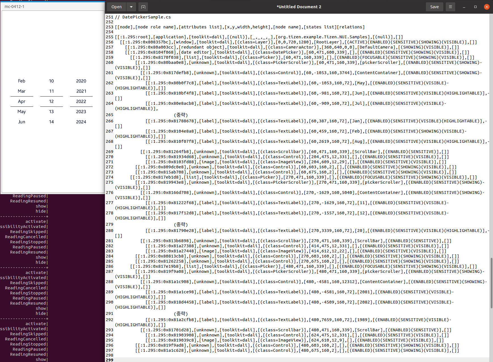

# DatePicker

TizenFX에 있는 Tizen.NUI.Samples의 샘플을 사용하여 확인했습니다.

`DatePicker` class를 확인하기 위해 

[DatePickerSample.cs](https://github.com/Samsung/TizenFX/blob/master/test/Tizen.NUI.Samples/Tizen.NUI.Samples/Samples/DatePickerSample.cs) 샘플을 통해 at-spi2-tool을 동작시켜 보았습니다.



왼쪽은 mobile emulator에서 샘플을 런칭한 화면이고, 오른쪽은 at-spi2-tool로 확인한 tree node입니다.

<br>

```
[[node],[node role name],[attributes list],[x,y,width,height],[node name],[states list][relations]

[[:1.295:root],[application],[toolkit=dali],[(null)],[_,_,_,_],[org.tizen.example.Tizen.NUI.Samples],[(null)],[]]
  [[:1.295:0x808357bc],[window],[toolkit=dali],[(class=Layer)],[0,0,720,1280],[RootLayer],[(ACTIVE)(ENABLED)(SENSITIVE)(SHOWING)(VISIBLE)],[]]
    [[:1.295:0x80a003cc],[redundant object],[toolkit=dali],[(class=CameraActor)],[360,640,0,0],[DefaultCamera],[(SHOWING)(VISIBLE)],[]]
    [[:1.295:0x8104f068],[date editor],[toolkit=dali],[(class=DatePicker)],[60,471,600,339],[],[(ENABLED)(SENSITIVE)(SHOWING)(VISIBLE)],[]]
      [[:1.295:0x8170f038],[list],[toolkit=dali],[(class=Picker)],[60,471,160,339],[],[(ENABLED)(FOCUSABLE)(SENSITIVE)(SHOWING)(VISIBLE)],[]]
        [[:1.295:0x80baa0e8],[unknown],[toolkit=dali],[(class=PickerScroller)],[60,471,160,339],[pickerScroller],[(ENABLED)(SENSITIVE)(SHOWING)(VISIBLE)],[]]
          [[:1.295:0x817defb8],[unknown],[toolkit=dali],[(class=Control)],[60,-1053,160,3744],[ContentContainer],[(ENABLED)(SENSITIVE)(SHOWING)(VISIBLE)],[]]
            [[:1.295:0x80b0f7c8],[label],[toolkit=dali],[(class=TextLabel)],[60,-1053,160,72],[May],[(ENABLED)(SENSITIVE)(VISIBLE)(HIGHLIGHTABLE)],[]]
            [[:1.295:0x810bf4f8],[label],[toolkit=dali],[(class=TextLabel)],[60,-981,160,72],[Jun],[(ENABLED)(SENSITIVE)(VISIBLE)(HIGHLIGHTABLE)],[]]
            [[:1.295:0x80e8acb8],[label],[toolkit=dali],[(class=TextLabel)],[60,-909,160,72],[Jul],[(ENABLED)(SENSITIVE)(VISIBLE)(HIGHLIGHTABLE)],            
            		(중략)
            [[:1.295:0x81788678],[label],[toolkit=dali],[(class=TextLabel)],[60,387,160,72],[Jan],[(ENABLED)(SENSITIVE)(VISIBLE)(HIGHLIGHTABLE)],[]]
            [[:1.295:0x8104e8a8],[label],[toolkit=dali],[(class=TextLabel)],[60,459,160,72],[Feb],[(ENABLED)(SENSITIVE)(SHOWING)(VISIBLE)(HIGHLIGHTABLE)],[]]
            [[:1.295:0x810f07f8],[label],[toolkit=dali],[(class=TextLabel)],[60,2619,160,72],[Aug],[(ENABLED)(SENSITIVE)(VISIBLE)(HIGHLIGHTABLE)],[]]
          [[:1.295:0x81264fb8],[unknown],[toolkit=dali],[(class=Scrollbar)],[60,471,160,339],[ScrollBar],[(ENABLED)(SENSITIVE)],[]]
            [[:1.295:0x81934d68],[unknown],[toolkit=dali],[(class=Control)],[204,475,12,331],[],[(ENABLED)(SENSITIVE)(VISIBLE)],[]]
            [[:1.295:0x8103fd88],[image],[toolkit=dali],[(class=ImageView)],[204,609,12,29],[],[(ENABLED)(SENSITIVE)(VISIBLE)],[]]
        [[:1.295:0x809dc0e8],[unknown],[toolkit=dali],[(class=Control)],[60,603,160,2],[],[(ENABLED)(SENSITIVE)(SHOWING)(VISIBLE)],[]]
        [[:1.295:0x815ab708],[unknown],[toolkit=dali],[(class=Control)],[60,675,160,2],[],[(ENABLED)(SENSITIVE)(SHOWING)(VISIBLE)],[]]
      [[:1.295:0x817eb1d8],[list],[toolkit=dali],[(class=Picker)],[270,471,160,339],[],[(ENABLED)(FOCUSABLE)(SENSITIVE)(SHOWING)(VISIBLE)],[]]
        [[:1.295:0x819943e8],[unknown],[toolkit=dali],[(class=PickerScroller)],[270,471,160,339],[pickerScroller],[(ENABLED)(SENSITIVE)(SHOWING)(VISIBLE)],[]]
          [[:1.295:0x8166d708],[unknown],[toolkit=dali],[(class=Control)],[270,-1629,160,5040],[ContentContainer],[(ENABLED)(SENSITIVE)(SHOWING)(VISIBLE)],[]]
            [[:1.295:0x81222f68],[label],[toolkit=dali],[(class=TextLabel)],[270,-1629,160,72],[11],[(ENABLED)(SENSITIVE)(VISIBLE)(HIGHLIGHTABLE)],[]]
            [[:1.295:0x817f12d8],[label],[toolkit=dali],[(class=TextLabel)],[270,-1557,160,72],[12],[(ENABLED)(SENSITIVE)(VISIBLE)(HIGHLIGHTABLE)],[]]
            		(중략)
            [[:1.295:0x81790e28],[label],[toolkit=dali],[(class=TextLabel)],[270,3339,160,72],[20],[(ENABLED)(SENSITIVE)(VISIBLE)(HIGHLIGHTABLE)],[]]
          [[:1.295:0x813b6898],[unknown],[toolkit=dali],[(class=Scrollbar)],[270,471,160,339],[ScrollBar],[(ENABLED)(SENSITIVE)],[]]
            [[:1.295:0x81a27388],[unknown],[toolkit=dali],[(class=Control)],[414,475,12,331],[],[(ENABLED)(SENSITIVE)(VISIBLE)],[]]
            [[:1.295:0x81a27448],[image],[toolkit=dali],[(class=ImageView)],[414,612,12,22],[],[(ENABLED)(SENSITIVE)(VISIBLE)],[]]
        [[:1.295:0x80813cb8],[unknown],[toolkit=dali],[(class=Control)],[270,603,160,2],[],[(ENABLED)(SENSITIVE)(SHOWING)(VISIBLE)],[]]
        [[:1.295:0x81262258],[unknown],[toolkit=dali],[(class=Control)],[270,675,160,2],[],[(ENABLED)(SENSITIVE)(SHOWING)(VISIBLE)],[]]
      [[:1.295:0x817e19b8],[list],[toolkit=dali],[(class=Picker)],[480,471,160,339],[],[(ENABLED)(FOCUSABLE)(SENSITIVE)(SHOWING)(VISIBLE)],[]]
        [[:1.295:0x819f9a08],[unknown],[toolkit=dali],[(class=PickerScroller)],[480,471,160,339],[pickerScroller],[(ENABLED)(SENSITIVE)(SHOWING)(VISIBLE)],[]]
          [[:1.295:0x81a1c908],[unknown],[toolkit=dali],[(class=Control)],[480,-4581,160,12312],[ContentContainer],[(ENABLED)(SENSITIVE)(SHOWING)(VISIBLE)],[]]
            [[:1.295:0x81a1ce98],[label],[toolkit=dali],[(class=TextLabel)],[480,-4581,160,72],[2081],[(ENABLED)(SENSITIVE)(VISIBLE)(HIGHLIGHTABLE)],[]]
            [[:1.295:0x818d4458],[label],[toolkit=dali],[(class=TextLabel)],[480,-4509,160,72],[2082],[(ENABLED)(SENSITIVE)(VISIBLE)(HIGHLIGHTABLE)],[]]
            		(중략)
            [[:1.295:0x81a2cfb8],[label],[toolkit=dali],[(class=TextLabel)],[480,7659,160,72],[1989],[(ENABLED)(SENSITIVE)(VISIBLE)(HIGHLIGHTABLE)],[]]
          [[:1.295:0x81701d28],[unknown],[toolkit=dali],[(class=Scrollbar)],[480,471,160,339],[ScrollBar],[(ENABLED)(SENSITIVE)],[]]
            [[:1.295:0x81903908],[unknown],[toolkit=dali],[(class=Control)],[624,475,12,331],[],[(ENABLED)(SENSITIVE)(VISIBLE)],[]]
            [[:1.295:0x819039c8],[image],[toolkit=dali],[(class=ImageView)],[624,610,12,9],[],[(ENABLED)(SENSITIVE)(VISIBLE)],[]]
        [[:1.295:0x819f9ad8],[unknown],[toolkit=dali],[(class=Control)],[480,603,160,2],[],[(ENABLED)(SENSITIVE)(SHOWING)(VISIBLE)],[]]
        [[:1.295:0x81a1c628],[unknown],[toolkit=dali],[(class=Control)],[480,675,160,2],[],[(ENABLED)(SENSITIVE)(SHOWING)(VISIBLE)],[]]

```

<br>

### `AccessibilityName`이 필요한 곳?
 : 비쥬얼 요소로 텍스트가 있는 Component

- N/A

<br>

### `AccessibilityHidden` 적용을 위해 고려할 사항

- TextLabel의 경우, 보이는 부분만 tree에 나오게
- 중간 중간에 있는 Control들과 마지막의 Control 두개까지... 

